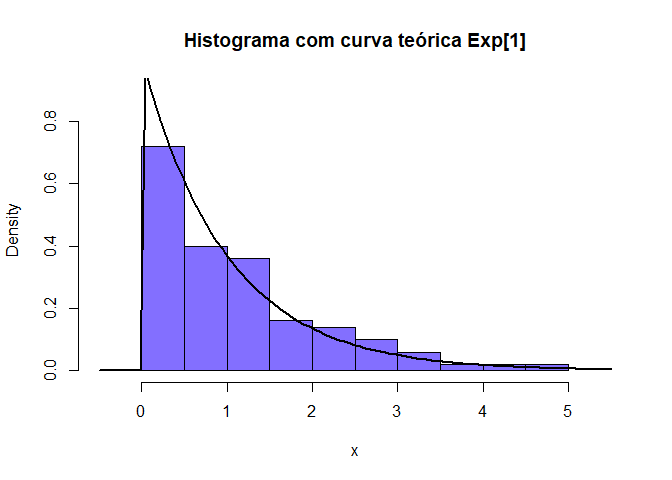

Distribuição Exponencial \(Exp[\lambda]\)
================

### Seja X uma variável aleatória contínua, X tem uma distribuição exponencial com \(\lambda > 0\) se sua função densidade probabilidade (f.d.p) for definida como:

\[ f(x, \lambda) =  \lambda\exp^{-\lambda x}, x \geq 0 \]

## Exemplos com X \~ \(Exp[\lambda = 1]\) (default)

### Cálculo da função densidade de probabilidade no ponto x = 1, com taxa de distribuicao \(\lambda\) = 1

\[ f(x, \lambda) = f(1, 1) = ?\]

``` r
quantil = 1
```

``` r
cat('f(1, 1) = ', dexp(quantil))
```

    ## f(1, 1) =  0.3678794

### Cálculo da probabilidade (f.d.a) \(P(X \leq 1)\) = ? (área sob a curva até o valor 1)

``` r
plot(dexp, 0, 6, lwd = 2, main = expression(paste('P(X', phantom()<= 1, ')')))
polygon(x = c(0, seq(0, quantil, by = 0.05), quantil), y = c(0, dexp(seq(0, quantil, by = 0.05)), 0), col = 'SlateBlue1')
legend("topright", legend = c(expression(paste(lambda, '= 1'))), 
       lty=1, col=c('black'), lwd=2, bty="n")
```

<!-- -->

``` r
cat('P(X <= 1) = ', pexp(quantil))
```

    ## P(X <= 1) =  0.6321206

#### ggplot

``` r
x.values = data.frame(x = seq(0, 6, by = 0.05))
```

``` r
ggplot(data = x.values, aes(x = x)) +
  geom_polygon(data = data.frame(x.p = c(min(x.values), seq(min(x.values), quantil, by = 0.05), quantil),
                                 y.p = c(0, dexp(seq(min(x.values), quantil, by = 0.05)), 0)), 
               aes(x = x.p, y = y.p), 
               fill = 'SlateBlue1') +
  geom_line(aes(y = dexp(x), color = 'black'), size = 1.3) +
  labs(title = expression(paste('P(X', phantom()<= 1, ')')), y = 'dexp') +
  scale_color_manual(name = NULL, values=c('black'),
                     labels = c(expression(paste(lambda, '= 1')))) +
  theme_classic() +
  theme(legend.position = 'top', legend.text = element_text(size = 12), 
        plot.title = element_text(hjust = 0.5, size = 15, face = 'bold'))
```

<!-- -->

### Cálculo da probabilidade (f.d.a) \(P(X \geq 1)\) = ? (área sob a curva a partir do valor 1)

``` r
plot(dexp, 0, 6, lwd = 2, main = expression(paste('P(X', phantom()>= 1, ')')))
polygon(x = c(quantil, seq(quantil, 6, by = 0.05), 6), y = c(0, dexp(seq(quantil, 6, by = 0.05)), 0), col = 'SlateBlue1')
legend("topright", legend = c(expression(paste(lambda, '= 1'))), 
       lty=1, col=c('black'), lwd=2, bty="n")
```

<!-- -->

``` r
cat('P(X >= 1) = ', pexp(quantil, lower.tail = FALSE))
```

    ## P(X >= 1) =  0.3678794

#### ggplot

``` r
ggplot(data = x.values, aes(x = x)) +
  geom_polygon(data = data.frame(x.p = c(quantil, seq(quantil, max(x.values), by = 0.05), max(x.values)),
                                 y.p = c(0, dexp(seq(quantil, max(x.values), by = 0.05)), 0)), 
               aes(x = x.p, y = y.p), 
               fill = 'SlateBlue1') +
  geom_line(aes(y = dexp(x), color = 'black'), size = 1.3) +
  labs(title = expression(paste('P(X', phantom()>= 1, ')')), y = 'dexp') +
  scale_color_manual(name = NULL, values=c('black'),
                     labels = c(expression(paste(lambda, '= 1')))) +
  theme_classic() +
  theme(legend.position = 'top', legend.text = element_text(size = 12), 
        plot.title = element_text(hjust = 0.5, size = 15, face = 'bold'))
```

<!-- -->

### Cálculo da probabilidade \(P(1 \leq X \leq 3)\) = ?

``` r
plot(dexp, 0, 6, lwd = 2, main = expression(paste('P(', 1 <= X,
                       phantom()<= 3, ')')), ylab = 'dexp')
polygon(x = c(quantil, seq(quantil, 3, by = 0.05), 3), y = c(0, dexp(seq(quantil, 3, by = 0.05)), 0), col = 'SlateBlue1')
legend("topright", legend = c(expression(paste(lambda, '= 1'))), 
       lty=1, col=c('black'), lwd=2, bty="n")
```

<!-- -->

``` r
cat('P(1 <= X <= 3) = ', pexp(quantil) - pexp(3))
```

    ## P(1 <= X <= 3) =  -0.3180924

#### ggplot

``` r
ggplot(data = x.values, aes(x = x)) +
  geom_polygon(data = data.frame(x.p = c(quantil, seq(quantil, 3, by = 0.05), 3),
                                 y.p = c(0, dexp(seq(quantil, 3, by = 0.05)), 0)), 
               aes(x = x.p, y = y.p), 
               fill = 'SlateBlue1') +
  geom_line(aes(y = dexp(x), color = 'black'), size = 1.3) +
  labs(title = expression(paste('P(', 1 <= X,
                       phantom()<= 3, ')')), y = 'dexp') +
  scale_color_manual(name = NULL, values=c('black'),
                     labels = c(expression(paste(lambda, '= 1')))) +
  theme_classic() +
  theme(legend.position = 'top', legend.text = element_text(size = 12), 
        plot.title = element_text(hjust = 0.5, size = 15, face = 'bold'))
```

<!-- -->

### Cálculo do quantil (x) correspondente a dada probabilidade p = 95%

\[P(X <= x) = 0.95 \\
     x = ?\]

``` r
cat('P(X <= x) = 0.95\n', 'x = ', qexp(0.95))
```

    ## P(X <= x) = 0.95
    ##  x =  2.995732

### Gera uma amostra de tamanho 100 da distribuicao exponencial

``` r
x = rexp(100)
```

``` r
hist(x, probability = TRUE, main = "Histograma com curva teórica Exp[1]", col = "SlateBlue1", xlim = lim.x, ylim = lim.y) 
curve(dexp(x), add=T, lwd = 2.5)
```

<!-- -->

``` r
hist(x, freq = F, main = "Gráfico de densidade estimada", col = "SlateBlue1", xlim = lim.x, ylim  = lim.y)
lines(density(x), lwd = 2.5)
```

<!-- -->

#### ggplot

``` r
x = as.data.frame(x)
ggplot(x, aes(x = x, y = after_stat(density))) +
  geom_histogram(fill = 'SlateBlue1', color = 'black', breaks = y$breaks) +
  geom_line(aes(y = dexp(x)), size = 1.5) +
  labs(title = expression(paste('Histograma com curva teórica Exp[1]'))) +
  theme_classic() +
    scale_x_continuous(limits = lim.x) +
  scale_y_continuous(limits = lim.y) +
  theme(plot.title = element_text(hjust = 0.5, size = 15, face = 'bold'))
```

    ## Warning: Removed 3 row(s) containing missing values (geom_path).

<!-- -->

``` r
ggplot(x, aes(x = x, y = after_stat(density))) +
  geom_histogram(fill = 'SlateBlue1', color = 'black', breaks = y$breaks) +
  geom_density(size = 1.5) +
  labs(title = "Gráfico de densidade estimada") +
  theme_classic() +
    scale_x_continuous(limits = lim.x) +
  scale_y_continuous(limits = lim.y) +
  theme(plot.title = element_text(hjust = 0.5, size = 15, face = 'bold'))
```

<!-- -->
