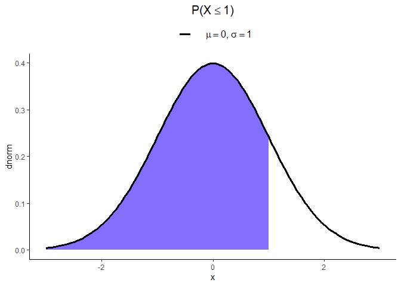

Distribuição Normal N\[\(\mu, \sigma^2\)\]
================

### Seja X uma variável aleatória contínua, X tem uma distribuição normal se sua função densidade probabilidade (f.d.p) for definida como:

\[ f(x, \mu, \sigma) = \frac{1}{\sigma \sqrt{2\pi}}\exp\left[-\frac{1}{2}\left(\frac{x - \mu}{\sigma}\right)^2\right] \]

## Exemplos com X \(\sim\) N\[0, 1\] \(\mu = 0, \sigma = 1\) (default)

### Cálculo da função densidade de probabilidade no quantil x = 1

\[ f(x, \mu, \sigma) = f(1, 0, 1) = ?\]

``` r
quantil = 1
```

``` r
cat('f(1, 0, 1) = ', dnorm(quantil))
```

    ## f(1, 0, 1) =  0.2419707

### Cálculo da probabilidade (f.d.a) \(P(X \leq 1)\) = ? (área sob a curva até o valor 1)

``` r
plot(dnorm, -3, 3, lwd = 2, main = expression(paste('P(X', phantom()<= 1, ')')))
polygon(x = c(-3, seq(-3, quantil, by = 0.05), quantil), y = c(0, dnorm(seq(-3, quantil, by = 0.05)), 0), col = 'SlateBlue1')
legend("topleft", legend = c(expression(paste(italic(mu) == 0, ', ', italic(sigma) == 1))), 
      lty=1, col=c('black'), lwd=2, bty="n")
```

<!-- -->

``` r
cat('P(X <= 1) = ', pnorm(quantil))
```

    ## P(X <= 1) =  0.8413447

### Cálculo da probabilidade \(P(X \geq 1)\) = ? (área sob a curva a partir do valor 1)

``` r
plot(dnorm, -3, 3, lwd = 2, main = expression(paste('P(X', phantom()>= 1, ')')))
polygon(x = c(quantil, seq(1, 3, by = 0.05), 3), y = c(0, dnorm(seq(quantil, 3, by = 0.05)), 0), col = 'SlateBlue1')
legend("topleft", legend = c(expression(paste(italic(mu) == 0, ', ', italic(sigma) == 1))), 
      lty=1, col=c('black'), lwd=2, bty="n")
```

<!-- -->

``` r
cat('P(X >= 1) = ', pnorm(quantil, lower.tail = FALSE))
```

    ## P(X >= 1) =  0.1586553

### Cálculo da probabilidade \(P(0.25 \leq X \leq 0.75)\) = ?

``` r
plot(dnorm, -3, 3, lwd = 2, main = expression(paste('P(', -1 <= X,
                       phantom()<= 1, ')')), ylab = 'dnorm')
polygon(x = c(-quantil, seq(-quantil, quantil, by = 0.05), quantil), y = c(0, dnorm(seq(-quantil, quantil, by = 0.05)), 0), col = 'SlateBlue1')
legend("topleft", legend = c(expression(paste(italic(mu) == 0, ', ', italic(sigma) == 1))), 
      lty=1, col=c('black'), lwd=2, bty="n")
```

<!-- -->

``` r
cat('P(-1 <= X <= 1) = ', punif(1) - punif(-1))
```

    ## P(-1 <= X <= 1) =  1

### Cálculo do quantil x correspondente a dada probabilidade p = 95%

\[P(X <= x) = 0.95 \\
     x = ?\]

``` r
cat('P(X <= x) = 0.95\n', 'x = ', qnorm(0.95))
```

    ## P(X <= x) = 0.95
    ##  x =  1.644854

### Gera uma amostra de tamanho 100 da distribuição normal

``` r
x = rnorm(100)
```

``` r
hist(x, probability = TRUE, main = "Histograma com curva teórica N[0, 1]", col = "SlateBlue1", xlim = lim.x, ylim = lim.y) 
curve(dnorm(x), add=T, lwd = 2.5)
```

<!-- -->

``` r
hist(x, freq = F, main = "Gráfico de densidade estimada", col = "SlateBlue1", xlim = lim.x, ylim = lim.y)
lines(density(x), lwd = 2.5)
```

<!-- -->

### Gráfico de distribuição de probabilidade normal com \(\mu = 25, \sigma = 10\) entre 0 e 50

``` r
plot(function(x) dnorm(x, 25, 10), 0, 50, ylab = 'dnorm')
```

<!-- -->
