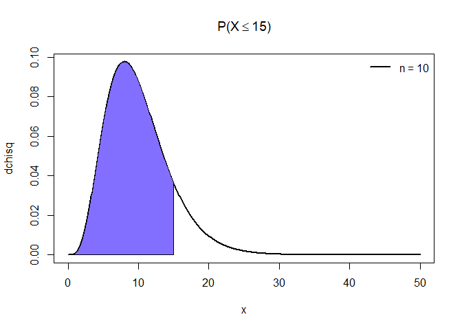
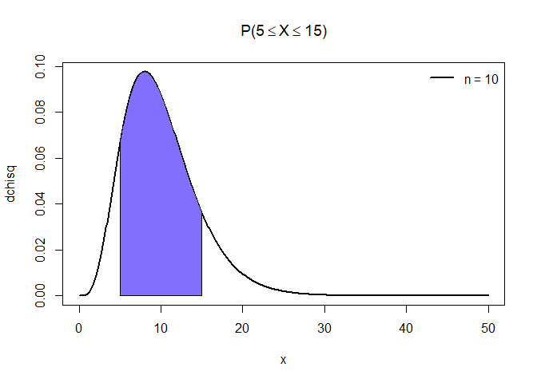
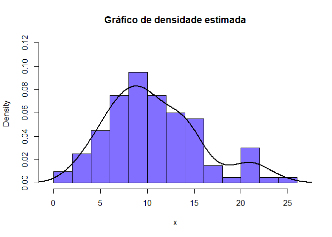

Distribuição Qui-quadrado \(\chi^2[n]\)
================

### Seja X uma variável aleatória contínua, X tem uma distribuição qui-quadrado com \(n\) graus de liberdade se sua função densidade probabilidade (f.d.p) for definida como:

\[ f(x, n) = \frac{1}{2^{n/2}\Gamma(n/2)}x^{\frac{n - 2}{2}}\exp\left[-\frac{x}{2}\right], x > 0, n > 0 \]

## Exemplos com X \(\sim \chi^2[10]\) n = 10 graus de liberdade

### Cálculo da função densidade de probabilidade no quantil x = 15, com n = 10 graus de liberdade

\[ f(x, n) = f(15, 10) = ?\]

``` r
quantil = 15
n = 10
```

``` r
cat('f(15, 10) = ', dchisq(quantil, n))
```

    ## f(15, 10) =  0.0364582

### Cálculo da probabilidade (f.d.a) \(P(X \leq 15)\) = ? (área sob a curva até o valor 15)

``` r
x = seq(0, 50, by = 0.1)
plot(x, dchisq(x, n), type = 'l', ylab = 'dchisq', lwd = 2, main = expression(paste('P(X', phantom()<= 15, ')')))
polygon(x = c(0, seq(0, quantil, by = 0.05), quantil), y = c(0, dchisq(seq(0, quantil, by = 0.05), n), 0), col = 'SlateBlue1')
legend("topright", legend = c('n = 10'), 
       lty=1, col=c('black'), lwd=2, bty="n")
```

<!-- -->

``` r
cat('P(X <= 15) = ', pchisq(quantil, n))
```

    ## P(X <= 15) =  0.8679381

### Cálculo da probabilidade \(P(X \geq 15)\) = ? (área sob a curva até o valor 15)

``` r
plot(x, dchisq(x, n), type = 'l', ylab = 'dchisq', lwd = 2, main = expression(paste('P(X', phantom()>= 15, ')')))
polygon(x = c(quantil, seq(quantil, 50, by = 0.05), 50), y = c(0, dchisq(seq(quantil, 50, by = 0.05), n), 0), col = 'SlateBlue1')
legend("topright", legend = c('n = 10'), 
       lty=1, col=c('black'), lwd=2, bty="n")
```

<!-- -->

``` r
cat('P(X >= 15) = ', pchisq(quantil, n, lower.tail = FALSE))
```

    ## P(X >= 15) =  0.1320619

### Cálculo da probabilidade \(P(5 \leq X \leq 15)\) = ?

``` r
plot(x, dchisq(x, n), type = 'l', ylab = 'dchisq', lwd = 2, main = expression(paste('P(', 5 <= X,
                       phantom()<= 15, ')')))
polygon(x = c(5, seq(5, 15, by = 0.05), 15), y = c(0, dchisq(seq(5, 15, by = 0.05), n), 0), col = 'SlateBlue1')
legend("topright", legend = c('n = 10'), 
       lty=1, col=c('black'), lwd=2, bty="n")
```

<!-- -->

``` r
cat('P(5 <= X <= 15) = ', pchisq(15, n) - pchisq(5, n))
```

    ## P(5 <= X <= 15) =  0.7591162

### Cálculo do quantil (x) correspondente a dada probabilidade p = 95%

\[P(X <= x) = 0.95 \\
     x = ?\]

``` r
cat('P(X <= x) = 0.95\n', 'x = ', qchisq(0.95, n))
```

    ## P(X <= x) = 0.95
    ##  x =  18.30704

### Gera uma amostra de tamanho 100 da distribuição de qui-quadrado

``` r
x = rchisq(100, n)
```

``` r
hist(x, probability = TRUE, main = expression(paste('Histograma com curva teórica ', chi^2, '[10]')),
     col = "SlateBlue1", xlim = lim.x, ylim = lim.y) 
curve(dchisq(x, n), add=T, lwd = 2.5)
```

<!-- -->

``` r
hist(x, freq = F, main = "Gráfico de densidade estimada", col = "SlateBlue1", xlim = lim.x, ylim = lim.y)
lines(density(x), lwd = 2.5)
```

<!-- -->
