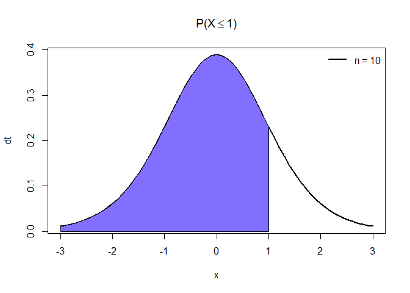
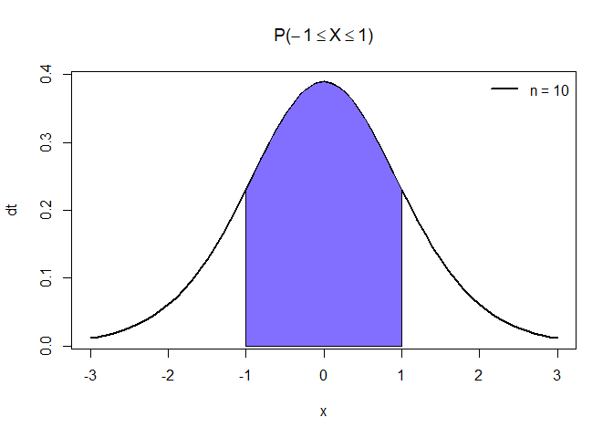
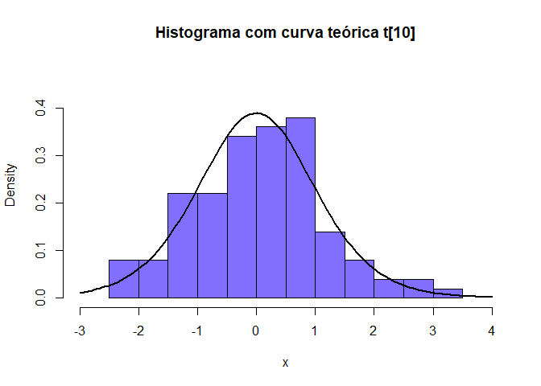
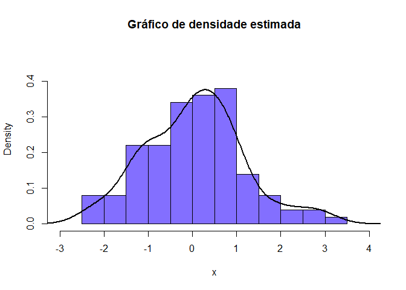

Distribuição t de Student t\[n\]
================

### Seja X uma variável aleatória contínua, X tem uma distribuição t de Student com \(n\) graus de liberdade se sua função densidade probabilidade (f.d.p) for definida como:

\[ f(x, n) = \frac{\Gamma \left(\frac{n + 1}{2}\right)}{\sqrt (n\pi)\Gamma(n/2)}\left(1 + \frac{x^2}{n}\right)^{-\frac{n + 1}{2}}, x > 0, n > 0 \]

## Exemplos com X \~ t\[10\] n = 10 graus de liberdade

### Cálculo da função densidade de probabilidade no quantil x = 1, com n = 10 graus de liberdade

\[ f(x, n) = f(1, 10) = ?\]

``` r
quantil = 1
n = 10
```

``` r
cat('f(1, 10) = ', dt(quantil, n))
```

    ## f(1, 10) =  0.230362

### Cálculo da probabilidade (f.d.a) \(P(X \leq 1)\) = ? (área sob a curva até o valor 1)

``` r
x = seq(-3, 3, by = 0.1)
plot(x, dt(x, n), type = 'l', ylab = 'dt', lwd = 2, main = expression(paste('P(X', phantom()<= 1, ')')))
polygon(x = c(-3, seq(-3, quantil, by = 0.05), quantil), y = c(0, dt(seq(-3, quantil, by = 0.05), n), 0), col = 'SlateBlue1')
legend("topright", legend = c('n = 10'), 
       lty=1, col=c('black'), lwd=2, bty="n")
```

<!-- -->

``` r
cat('P(X <= 1) = ', pt(quantil, n))
```

    ## P(X <= 1) =  0.8295534

### Cálculo da probabilidade (f.d.a) \(P(X \geq 1)\) = ? (área sob a curva a partir do valor 1)

``` r
plot(x, dt(x, n), type = 'l', ylab = 'dt', lwd = 2, main = expression(paste('P(X', phantom()>= 1, ')')))
polygon(x = c(quantil, seq(quantil, 3, by = 0.05), 3), y = c(0, dt(seq(quantil, 3, by = 0.05), n), 0), col = 'SlateBlue1')
legend("topright", legend = c('n = 10'), 
       lty=1, col=c('black'), lwd=2, bty="n")
```

<!-- -->

``` r
cat('P(X >= 1) = ', pt(quantil, n, lower.tail = FALSE))
```

    ## P(X >= 1) =  0.1704466

### Cálculo da probabilidade \(P(-1 \leq X \leq 1)\) = ?

``` r
plot(x, dt(x, n), type = 'l', ylab = 'dt', lwd = 2, main = expression(paste('P(', -1 <= X,
                       phantom()<= 1, ')')))
polygon(x = c(-quantil, seq(-quantil, quantil, by = 0.05), quantil), y = c(0, dt(seq(-quantil, quantil, by = 0.05), n), 0), col = 'SlateBlue1')
legend("topright", legend = c('n = 10'), 
       lty=1, col=c('black'), lwd=2, bty="n")
```

<!-- -->

``` r
cat('P(-1 <= X <= 1) = ', pt(-quantil, n) - pt(quantil, n))
```

    ## P(-1 <= X <= 1) =  -0.6591069

### Cálculo do quantil (x) correspondente a dada probabilidade p = 95%

\[P(X <= x) = 0.95 \\
     x = ?\]

``` r
cat('P(X <= x) = 0.95\n', 'x = ', qt(0.95, n))
```

    ## P(X <= x) = 0.95
    ##  x =  1.812461

### Gera uma amostra de tamanho 100 da distribuição t de Student

``` r
x = rt(100, n)
```

``` r
hist(x, probability = TRUE, main = "Histograma com curva teórica t[10]", col = "SlateBlue1", xlim = lim.x, ylim = lim.y) 
curve(dt(x, n), add=T, lwd = 2.5)
```

<!-- -->

``` r
hist(x, freq = F, main = "Gráfico de densidade estimada", col = "SlateBlue1", xlim = lim.x, ylim = lim.y)
lines(density(x), lwd = 2.5)
```

<!-- -->
