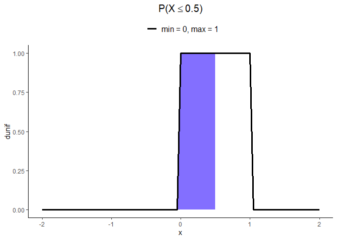
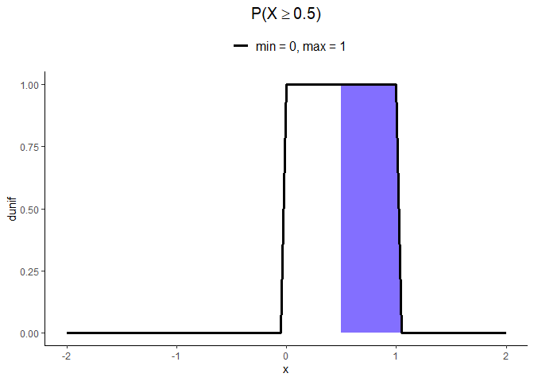
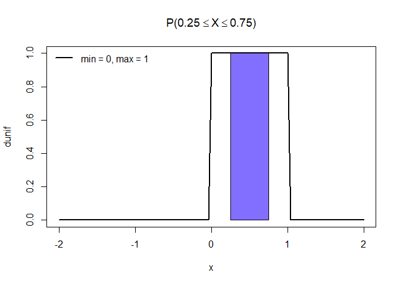
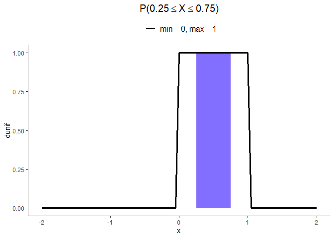
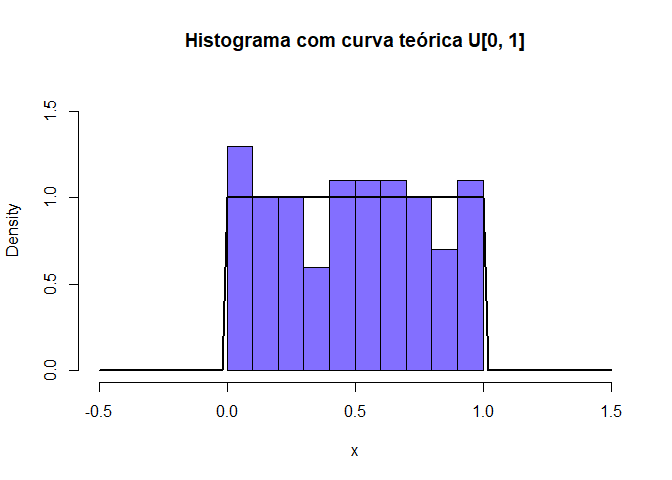
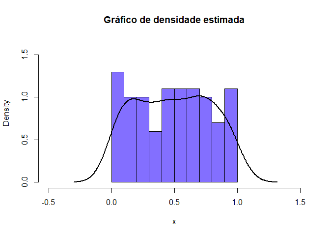
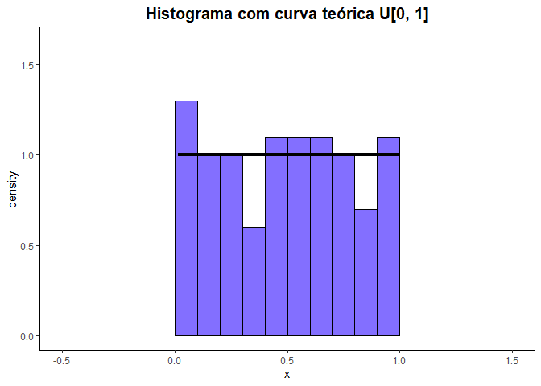
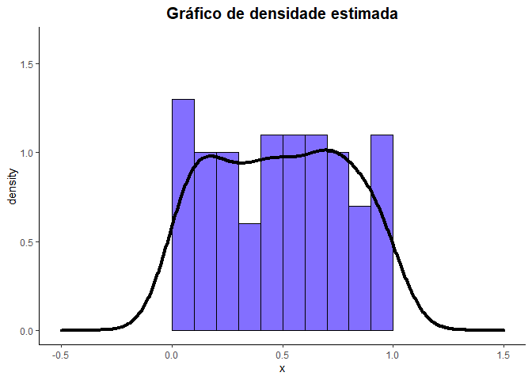

Distribuição Uniforme U\[min, max\]
================

### Seja X uma variável aleatória contínua, X tem uma distribuição uniforme se sua função densidade probabilidade (f.d.p) for definida como:

\[ f(x, min, max) = \frac{1}{max - min}, min \leq x \leq max\]

## Exemplos com X \~ U\[0, 1\] min = 0, max = 1 (default)

### Cálculo da funcao densidade de probabilidade no quantil x = 0.5

\[ f(x, min, max) = f(0.5, 0, 1) = ?\]

``` r
quantil = 0.5
```

``` r
cat('f(0.5, 0, 1) = ', dunif(quantil))
```

    ## f(0.5, 0, 1) =  1

### Cálculo da probabilidade (f.d.a) \(P(X \leq 0.5)\) = ? (área sob a reta até o valor 0.5)

``` r
plot(dunif, -2, 2, lwd = 2, main = expression(paste('P(X', phantom()<= 0.5, ')')), ylim = c(0, 1), ylab = 'dunif')
polygon(x = c(0, seq(0, quantil, by = 0.05), quantil), y = c(0, dunif(seq(0, quantil, by = 0.05)), 0), col = 'SlateBlue1')
legend("topleft", legend = c('min = 0, max = 1'), 
      lty=1, col=c('black'), lwd=2, bty="n")
```

<!-- -->

``` r
cat('P(X <= 0.5) = ', punif(quantil))
```

    ## P(X <= 0.5) =  0.5

#### ggplot

``` r
x.values = data.frame(x = seq(-2, 2, by = 0.05))
```

``` r
ggplot(data = x.values, aes(x = x)) +
  geom_polygon(data = data.frame(x.p = c(min(x.values), seq(min(x.values), quantil, by = 0.05), quantil),
                                 y.p = c(0, dunif(seq(min(x.values), quantil, by = 0.05)), 0)), 
               aes(x = x.p, y = y.p), 
               fill = 'SlateBlue1') +
  geom_line(aes(y = dunif(x), color = 'black'), size = 1.3) +
  labs(title = expression(paste('P(X', phantom()<= 0.5, ')')), y = 'dunif') +
  scale_color_manual(name = NULL, values=c('black'),
                     labels = c('min = 0, max = 1')) +
  theme_classic() +
  theme(legend.position = 'top', legend.text = element_text(size = 12), 
        plot.title = element_text(hjust = 0.5, size = 15, face = 'bold'))
```

<!-- -->

### Cálculo da probabilidade \(P(X \geq 0.5)\) = ? (área sob a reta a partir do valor 0.5)

``` r
plot(dunif, -2, 2, lwd = 2, main = expression(paste('P(X', phantom()>= 0.5, ')')), ylim = c(0, 1), ylab = 'dunif')
polygon(x = c(quantil, seq(quantil, 1, by = 0.05), 1), y = c(0, dunif(seq(quantil, 1, by = 0.05)), 0), col = 'SlateBlue1')
legend("topleft", legend = c('min = 0, max = 1'), 
      lty=1, col=c('black'), lwd=2, bty="n")
```

<!-- -->

``` r
cat('P(X >= 0.5) = ', punif(quantil, lower.tail = FALSE))
```

    ## P(X >= 0.5) =  0.5

#### ggplot

``` r
ggplot(data = x.values, aes(x = x)) +
  geom_polygon(data = data.frame(x.p = c(quantil, seq(quantil, max(x.values), by = 0.05), 1),
                                 y.p = c(0, dunif(seq(quantil, max(x.values), by = 0.05)), 0)), 
               aes(x = x.p, y = y.p), 
               fill = 'SlateBlue1') +
  geom_line(aes(y = dunif(x), color = 'black'), size = 1.3) +
  labs(title = expression(paste('P(X', phantom()>= 0.5, ')')), y = 'dunif') +
  scale_color_manual(name = NULL, values=c('black'),
                     labels = c('min = 0, max = 1')) +
  theme_classic() +
  theme(legend.position = 'top', legend.text = element_text(size = 12), 
        plot.title = element_text(hjust = 0.5, size = 15, face = 'bold'))
```

<!-- -->

### Cálculo da probabilidade \(P(0.25 \leq X \leq 0.75)\) = ?

``` r
plot(dunif, -2, 2, lwd = 2, main = expression(paste('P(', 0.25 <= X,
                       phantom()<= 0.75, ')')), ylim = c(0, 1), ylab = 'dunif')
polygon(x = c(0.25, seq(0.25, 0.75, by = 0.05), 0.75), y = c(0, dunif(seq(0.25, 0.75, by = 0.05)), 0), col = 'SlateBlue1')
legend("topleft", legend = c('min = 0, max = 1'), 
      lty=1, col=c('black'), lwd=2, bty="n")
```

<!-- -->

``` r
cat('P(0.25 <= X <= 0.75) = ', punif(0.75) - punif(0.25))
```

    ## P(0.25 <= X <= 0.75) =  0.5

#### ggplot

``` r
ggplot(data = x.values, aes(x = x)) +
  geom_polygon(data = data.frame(x.p = c(0.25, seq(0.25, 0.75, by = 0.05), 0.75),
                                 y.p = c(0, dunif(seq(0.25, 0.75, by = 0.05)), 0)), 
               aes(x = x.p, y = y.p), 
               fill = 'SlateBlue1') +
  geom_line(aes(y = dunif(x), color = 'black'), size = 1.3) +
  labs(title = expression(paste('P(', 0.25 <= X,
                       phantom()<= 0.75, ')')), y = 'dunif') +
  scale_color_manual(name = NULL, values=c('black'),
                     labels = c('min = 0, max = 1')) +
  theme_classic() +
  theme(legend.position = 'top', legend.text = element_text(size = 12), 
        plot.title = element_text(hjust = 0.5, size = 15, face = 'bold'))
```

<!-- -->

### Cálculo do quantil (x) correspondente a dada probabilidade p = 95%

\[P(X <= x) = 0.95 \\
     x = ?\]

``` r
cat('x = ', qunif(0.95))
```

    ## x =  0.95

### Gera uma amostra de tamanho 100 da distribuicao uniforme

``` r
x = runif(100)
```

``` r
hist(x, probability = TRUE, main = "Histograma com curva teórica U[0, 1]", col = "SlateBlue1", xlim = lim.x, ylim = lim.y)
curve(dunif(x), add=T, lwd = 2.5) 
```

<!-- -->

``` r
hist(x, freq = F, main = "Gráfico de densidade estimada", col = "SlateBlue1", xlim = lim.x, ylim = lim.y)
lines(density(x), lwd = 2.5)
```

<!-- -->

#### ggplot

``` r
x = as.data.frame(x)
ggplot(x, aes(x = x, y = after_stat(density))) +
  geom_histogram(fill = 'SlateBlue1', color = 'black', breaks = y$breaks) +
  geom_line(aes(y = dunif(x)), size = 1.5) +
  labs(title = "Histograma com curva teórica U[0, 1]") +
  theme_classic() +
  scale_x_continuous(limits = lim.x) +
  scale_y_continuous(limits = lim.y) +
  theme(plot.title = element_text(hjust = 0.5, size = 15, face = 'bold'))
```

<!-- -->

``` r
ggplot(x, aes(x = x, y = after_stat(density))) +
  geom_histogram(fill = 'SlateBlue1', color = 'black', breaks = y$breaks) +
  geom_density(size = 1.5) +
  labs(title = "Gráfico de densidade estimada") +
  theme_classic() +
  scale_x_continuous(limits = lim.x) +
  scale_y_continuous(limits = lim.y) +
  theme(plot.title = element_text(hjust = 0.5, size = 15, face = 'bold'))
```

<!-- -->
