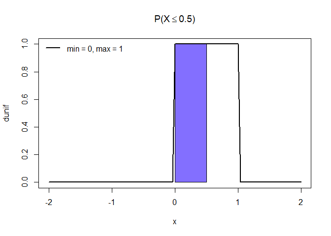
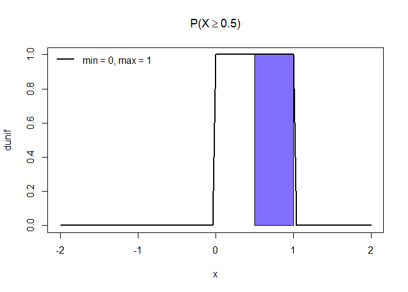
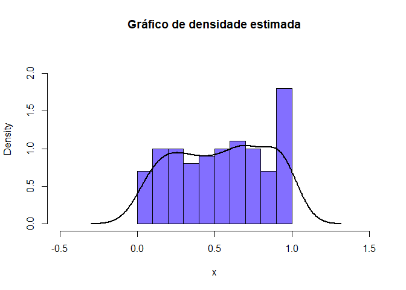

Distribuição Uniforme U\[min, max\]
================

### Seja X uma variável aleatória contínua, X tem uma distribuição uniforme se sua função densidade probabilidade (f.d.p) for definida como:

\[ f(x, min, max) = \frac{1}{max - min}, min \leq x \leq max\]

## Exemplos com X \~ U\[0, 1\] min = 0, max = 1 (default)

### Cálculo da funcao densidade de probabilidade no quantil x = 0.5

\[ f(x, min, max) = f(0.5, 0, 1) = ?\]

``` r
quantil = 0.5
```

``` r
cat('f(0.5, 0, 1) = ', dunif(quantil))
```

    ## f(0.5, 0, 1) =  1

### Cálculo da probabilidade (f.d.a) \(P(X \leq 0.5)\) = ? (área sob a reta até o valor 0.5)

``` r
plot(dunif, -2, 2, lwd = 2, main = expression(paste('P(X', phantom()<= 0.5, ')')), ylim = c(0, 1), ylab = 'dunif')
polygon(x = c(0, seq(0, quantil, by = 0.05), quantil), y = c(0, dunif(seq(0, quantil, by = 0.05)), 0), col = 'SlateBlue1')
legend("topleft", legend = c('min = 0, max = 1'), 
      lty=1, col=c('black'), lwd=2, bty="n")
```

<!-- -->

``` r
cat('P(X <= 0.5) = ', punif(quantil))
```

    ## P(X <= 0.5) =  0.5

### Cálculo da probabilidade \(P(X \geq 0.5)\) = ? (área sob a reta a partir do valor 0.5)

``` r
plot(dunif, -2, 2, lwd = 2, main = expression(paste('P(X', phantom()>= 0.5, ')')), ylim = c(0, 1), ylab = 'dunif')
polygon(x = c(quantil, seq(quantil, 1, by = 0.05), 1), y = c(0, dunif(seq(quantil, 1, by = 0.05)), 0), col = 'SlateBlue1')
legend("topleft", legend = c('min = 0, max = 1'), 
      lty=1, col=c('black'), lwd=2, bty="n")
```

<!-- -->

``` r
cat('P(X >= 0.5) = ', punif(quantil, lower.tail = FALSE))
```

    ## P(X >= 0.5) =  0.5

### Cálculo da probabilidade \(P(0.25 \leq X \leq 0.75)\) = ?

``` r
plot(dunif, -2, 2, lwd = 2, main = expression(paste('P(', 0.25 <= X,
                       phantom()<= 0.75, ')')), ylim = c(0, 1), ylab = 'dunif')
polygon(x = c(0.25, seq(0.25, 0.75, by = 0.05), 0.75), y = c(0, dunif(seq(0.25, 0.75, by = 0.05)), 0), col = 'SlateBlue1')
legend("topleft", legend = c('min = 0, max = 1'), 
      lty=1, col=c('black'), lwd=2, bty="n")
```

<!-- -->

``` r
cat('P(0.25 <= X <= 0.75) = ', punif(0.75) - punif(0.25))
```

    ## P(0.25 <= X <= 0.75) =  0.5

### Cálculo do quantil (x) correspondente a dada probabilidade p = 95%

\[P(X <= x) = 0.95 \\
     x = ?\]

``` r
cat('x = ', qunif(0.95))
```

    ## x =  0.95

### Gera uma amostra de tamanho 100 da distribuicao uniforme

``` r
x = runif(100)
```

``` r
hist(x, probability = TRUE, main = "Histograma com curva teórica U[0, 1]", col = "SlateBlue1", xlim = lim.x, ylim = lim.y)
curve(dunif(x), add=T, lwd = 2.5) 
```

<!-- -->

``` r
hist(x, freq = F, main = "Gráfico de densidade estimada", col = "SlateBlue1", xlim = lim.x, ylim = lim.y)
lines(density(x), lwd = 2.5)
```

<!-- -->

### Gráfico de distribuição de probabilidade uniforme X \~ U\[5, 20\] entre 0 e 50

``` r
plot(function(x) dunif(x, 5, 20), 0, 50, ylab = 'dunif')
```

<!-- -->
