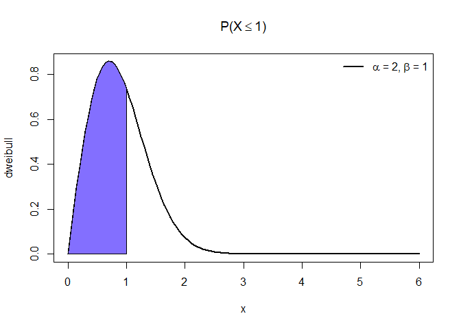
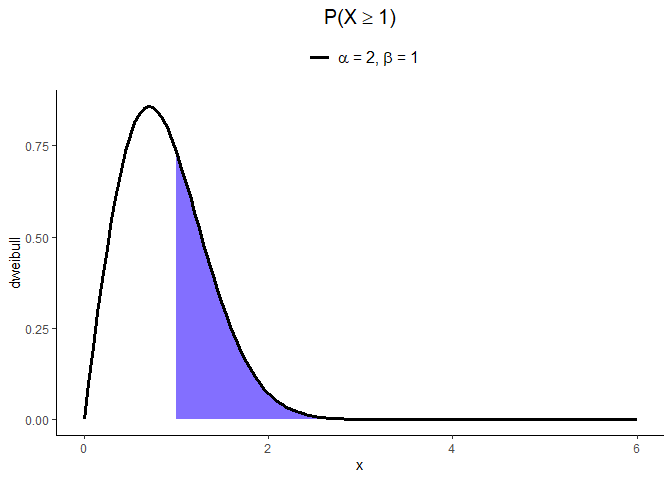
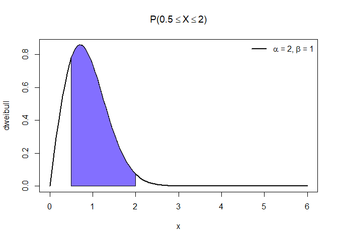

Distribuição Weibull W\[\(\alpha, \beta\)\]
================

### Seja X uma variável aleatória contínua, X tem uma distribuição weibull com forma (shape) \(\alpha > 0\) e escala (scale) \(\beta > 0\) se sua função densidade probabilidade (f.d.p) for definida como:

\[ f(x, \alpha, \beta) =  \frac{\alpha}{\beta}\left(\frac{x}{\beta}\right)^{\alpha - 1}\exp\left[-\frac{\alpha}{\beta}\right]^\alpha, x > 0 \]

## Exemplos com X \~ W\[2, 1\] \(\alpha = 2, \beta = 1\) (default)

### Cálculo da função densidade de probabilidade no quantil x = 1, com \(\alpha\) (shape) = 2 e \(\beta\) (scale) = 1

\[ f(x, \alpha, \beta) = f(1, 2, 1) = ?\]

``` r
quantil = 1
shape = 2
```

``` r
cat('f(1, 2, 1) = ', dweibull(quantil, shape))
```

    ## f(1, 2, 1) =  0.7357589

### Cálculo da probabilidade (f.d.a) \(P(X \leq 1)\) = ? (área sob a curva até o valor 1)

``` r
x = seq(0, 6, by = 0.05)
```

``` r
plot(x, dweibull(x, shape), type = 'l', ylab = 'dweibull', lwd = 2, main = expression(paste('P(X', phantom()<= 1, ')')))
polygon(x = c(0, seq(0, quantil, by = 0.05), quantil), y = c(0, dweibull(seq(0, quantil, by = 0.05), shape), 0), col = 'SlateBlue1')
legend("topright", legend = c(expression(paste(alpha, ' = 2, ', beta, ' = 1'))), lty=1, col=c('black'), lwd=2, bty="n")
```

<!-- -->

``` r
cat('P(X <= 1) = ', pweibull(quantil, shape))
```

    ## P(X <= 1) =  0.6321206

#### ggplot

``` r
x.values = data.frame(x = seq(0, 6, by = 0.05))
```

``` r
ggplot(data = x.values, aes(x = x)) +
  geom_polygon(data = data.frame(x.p = c(min(x.values), seq(min(x.values), quantil, by = 0.05), quantil),
                                 y.p = c(0, dweibull(seq(min(x.values), quantil, by = 0.05), shape), 0)), 
               aes(x = x.p, y = y.p), 
               fill = 'SlateBlue1') +
  geom_line(aes(y = dweibull(x, shape), color = 'black'), size = 1.3) +
  labs(title = expression(paste('P(X', phantom()<= 1, ')')), y = 'dweibull') +
  scale_color_manual(name = NULL, values=c('black'),
                     labels = expression(paste(alpha, ' = 2, ', beta, ' = 1'))) +
  theme_classic() +
  theme(legend.position = 'top', legend.text = element_text(size = 12), 
        plot.title = element_text(hjust = 0.5, size = 15, face = 'bold'))
```

<!-- -->

### Cálculo da probabilidade (f.d.a) \(P(X \geq 1)\) = ? (área sob a curva a partir do valor 1)

``` r
plot(x, dweibull(x, shape), type = 'l', ylab = 'dweibull', lwd = 2, main = expression(paste('P(X', phantom()>= 1, ')')))
polygon(x = c(quantil, seq(quantil, 6, by = 0.05), 6), y = c(0, dweibull(seq(quantil, 6, by = 0.05), shape), 0), col = 'SlateBlue1')
legend("topright", legend = c(expression(paste(alpha, ' = 2, ', beta, ' = 1'))), lty=1, col=c('black'), lwd=2, bty="n")
```

<!-- -->

``` r
cat('P(X >= 1) = ', pweibull(quantil, shape, lower.tail = FALSE))
```

    ## P(X >= 1) =  0.3678794

#### ggplot

``` r
ggplot(data = x.values, aes(x = x)) +
  geom_polygon(data = data.frame(x.p = c(quantil, seq(quantil, max(x.values), by = 0.05), 6),
                                 y.p = c(0, dweibull(seq(quantil, max(x.values), by = 0.05), shape), 0)), 
               aes(x = x.p, y = y.p), 
               fill = 'SlateBlue1') +
  geom_line(aes(y = dweibull(x, shape), color = 'black'), size = 1.3) +
  labs(title = expression(paste('P(X', phantom()>= 1, ')')), y = 'dweibull') +
  scale_color_manual(name = NULL, values=c('black'),
                     labels = expression(paste(alpha, ' = 2, ', beta, ' = 1'))) +
  theme_classic() +
  theme(legend.position = 'top', legend.text = element_text(size = 12), 
        plot.title = element_text(hjust = 0.5, size = 15, face = 'bold'))
```

<!-- -->

### Cálculo da probabilidade \(P(0.5 \leq X \leq 2)\) = ?

``` r
plot(x, dweibull(x, shape), type = 'l', ylab = 'dweibull', lwd = 2, main = expression(paste('P(', 0.5 <= X,
                       phantom()<= 2, ')')))
polygon(x = c(0.5, seq(0.5, 2, by = 0.05), 2), y = c(0, dweibull(seq(0.5, 2, by = 0.05), shape), 0), col = 'SlateBlue1')
legend("topright", legend = c(expression(paste(alpha, ' = 2, ', beta, ' = 1'))), lty=1, col=c('black'), lwd=2, bty="n")
```

<!-- -->

#### ggplot

``` r
ggplot(data = x.values, aes(x = x)) +
  geom_polygon(data = data.frame(x.p = c(0.5, seq(0.5, 2, by = 0.05), 2),
                                 y.p = c(0, dweibull(seq(0.5, 2, by = 0.05), shape), 0)), 
               aes(x = x.p, y = y.p), 
               fill = 'SlateBlue1') +
  geom_line(aes(y = dweibull(x, shape), color = 'black'), size = 1.3) +
  labs(title = expression(paste('P(', 0.5 <= X,
                       phantom()<= 2, ')')), y = 'dweibull') +
  scale_color_manual(name = NULL, values=c('black'),
                     labels = expression(paste(alpha, ' = 2, ', beta, ' = 1'))) +
  theme_classic() +
  theme(legend.position = 'top', legend.text = element_text(size = 12), 
        plot.title = element_text(hjust = 0.5, size = 15, face = 'bold'))
```

<!-- -->

### Cálculo do quantil (x) correspondente a dada probabilidade p = 95%

\[P(X <= x) = 0.95 \\
     x = ?\]

``` r
cat('P(X <= x) = 0.95\n', 'x = ', qweibull(0.95, shape))
```

    ## P(X <= x) = 0.95
    ##  x =  1.730818

### Gera amostra de tamanho 100 da distribuicao de weibull

``` r
x = rweibull(100, shape)
```

``` r
hist(x, probability = TRUE, main = "Histograma com curva teórica W[2, 1]", col = "SlateBlue1", xlim = lim.x, ylim = lim.y) 
curve(dweibull(x, shape), add=T, lwd = 2.5)
```

<!-- -->

``` r
hist(x, freq = F, main = "Gráfico de densidade estimada", col = "SlateBlue1", xlim = lim.x, ylim = lim.y)
lines(density(x), lwd = 2.5)
```

<!-- -->

#### ggplot

``` r
x = as.data.frame(x)
ggplot(x, aes(x = x, y = after_stat(density))) +
  geom_histogram(fill = 'SlateBlue1', color = 'black', breaks = y$breaks) +
  geom_line(aes(y = dweibull(x, shape)), size = 1.5) +
  labs(title = "Histograma com curva teórica W[2, 1]") +
  theme_classic() +
  scale_x_continuous(limits = lim.x) +
  scale_y_continuous(limits = lim.y) +
  theme(plot.title = element_text(hjust = 0.5, size = 15, face = 'bold'))
```

<!-- -->

``` r
ggplot(x, aes(x = x, y = after_stat(density))) +
  geom_histogram(fill = 'SlateBlue1', color = 'black', breaks = y$breaks) +
  geom_density(size = 1.5) +
  labs(title = "Gráfico de densidade estimada") +
  theme_classic() +
  scale_x_continuous(limits = lim.x) +
  scale_y_continuous(limits = lim.y) +
  theme(plot.title = element_text(hjust = 0.5, size = 15, face = 'bold'))
```

<!-- -->
