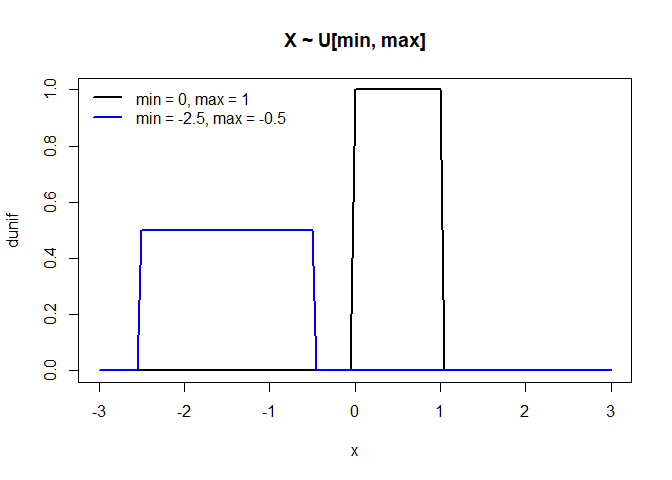
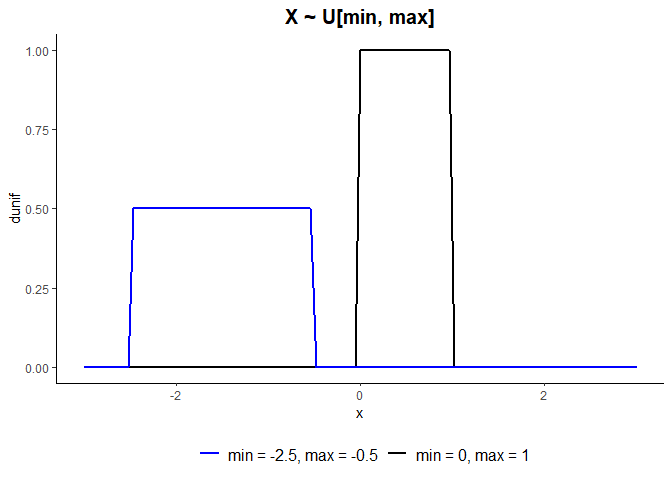
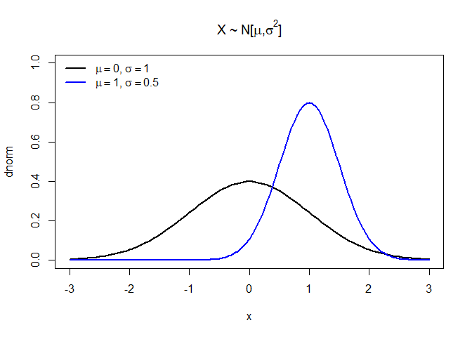
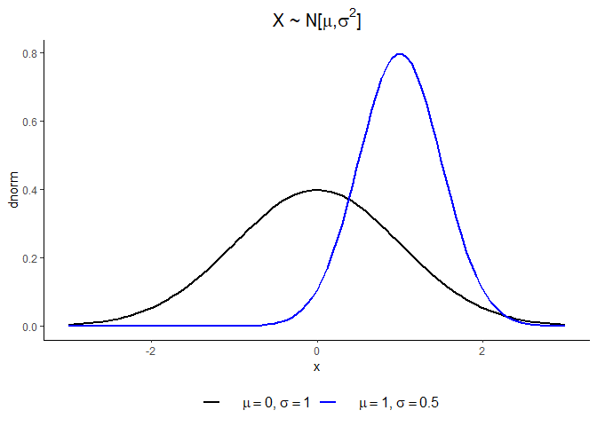
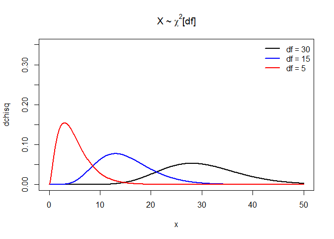
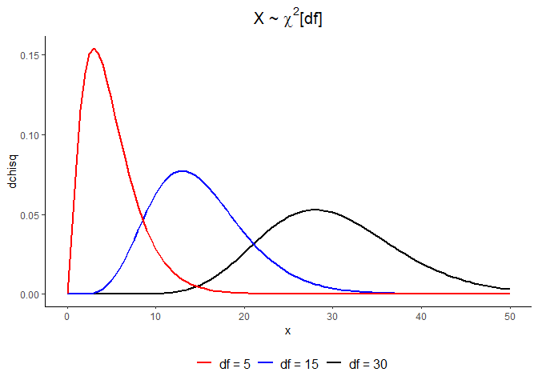
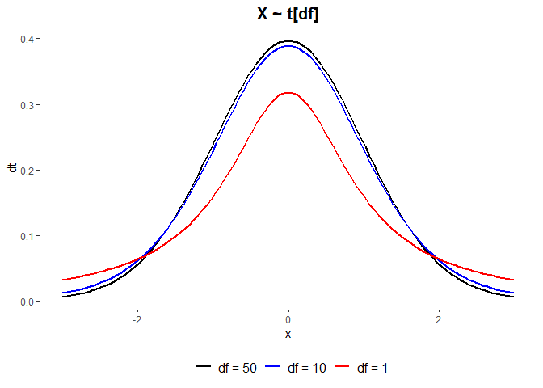
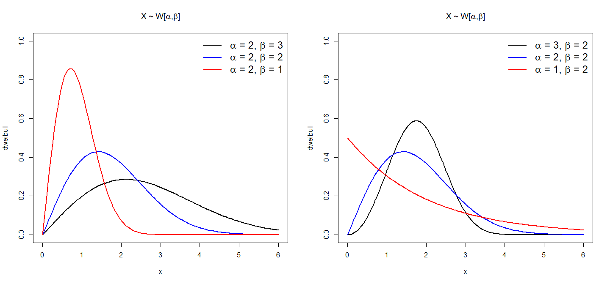

Modelos Probabilísticos Contínuos
================

# Distribuições de probabilidade

## O R possui quatro funções para cada distribuição de probabilidade:

  - Função de densidade (f.d.p): prefixo **d** +
    **\[nome\_da\_distribuicao\]**
  - Função de probabilidade acumulada (f.d.a): prefixo **p** +
    **\[nome\_da\_distribuicao\]**
  - Quantil correspondente a dada probabilidade: **q** +
    **\[nome\_da\_distribuicao\]**  
  - Gerador aleatório de uma amostra da distribuição: **r** +
    **\[nome\_da\_distribuicao\]**

| Distribuicao | Parametros   | f.d.p    | f.d.a    | Quantil  | Amostra  |
| :----------- | :----------- | :------- | :------- | :------- | :------- |
| Uniforme     | min, max     | dunif    | punif    | qunif    | runif    |
| Normal       | mean, sd     | dnorm    | pnorm    | qnorm    | rnorm    |
| Qui-quadrado | df           | dchisq   | pchisq   | qchisq   | rchisq   |
| t de Student | df           | dt       | pt       | qt       | rt       |
| Exponencial  | rate         | dexp     | pexp     | qexp     | rexp     |
| Weibull      | shape, scale | dweibull | pweibull | qweibull | rweibull |

# Uniforme U\[min, max\]

``` r
x = seq(-3, 3, by = 0.05)
plot(x, dunif(x), type = 'l', main = 'Uniforme U[min, max]', lwd = 2, ylim = c(0, 1), ylab = 'dunif')
lines(x, dunif(x, -2.5, -0.5), lwd = 2, col = 'blue')
legend("topleft", legend = c('min = 0, max = 1', 'min = -2.5, max = -0.5'), 
      lty=1, col=c('black', 'blue'), lwd=2, bty="n")
```

<!-- -->

# \[ggplot\] - Uniforme U\[min, max\]

``` r
ggplot(data.frame(x = seq(-3, 3, by = 0.05)), aes(x = x)) +
  stat_function(fun = dunif, geom = "line", size = 1, aes(color = 'black')) +
  stat_function(fun = dunif, geom = "line", size = 1, aes(color = 'blue'), 
                args = list(min = -2.5, max = -0.5)) +
  labs(title = 'Uniforme U[min, max]', y = 'dunif') +
  scale_color_manual(name = NULL, values=c('black', 'blue'),
                     labels = c('min = 0, max = 1', 'min = -2.5, max = -0.5')) +
  theme_classic() +
  guides(color = guide_legend(reverse = TRUE)) + #Reverse legend order
  theme(legend.position = 'bottom', legend.text = element_text(size = 12), 
        plot.title = element_text(hjust = 0.5, size = 15, face = 'bold'))
```

<!-- -->

# Normal N\[\(\mu, \sigma^2\)\]

``` r
plot(x, dnorm(x), type = 'l', main = expression(paste('Normal N[', italic(mu), ',', italic(sigma^2), ']')), lwd = 2, ylim = c(0, 1), ylab = 'dnorm')
lines(x, dnorm(x, 1, 0.5), lwd = 2, col = 'blue')
legend("topleft", legend = c(expression(paste(italic(mu) == 0, ', ', italic(sigma) == 1)),
                             expression(paste(italic(mu) == 1, ', ', italic(sigma) == 0.5))), 
      lty=1, col=c('black', 'blue'), lwd=2, bty="n")
```

<!-- -->

# \[ggplot\] - Normal N\[\(\mu, \sigma^2\)\]

``` r
ggplot(data.frame(x = seq(-3, 3, by = 0.05)), aes(x = x)) +
  stat_function(fun = dnorm, geom = "line", size = 1, aes(color = 'black')) +
  stat_function(fun = dnorm, geom = "line", size = 1, aes(color = 'blue'), 
                args = list(mean=1, sd = 0.5)) +
  labs(title = expression(paste('Normal N[', mu, ',', sigma^2, ']')), y = 'dnorm') +
  scale_color_manual(name = NULL, values=c('black', 'blue'),
                     labels = expression(paste('    ', mu == 0, ', ', sigma == 1), 
                                         paste('    ', mu == 1, ', ', sigma == 0.5))) +
  theme_classic() +
  theme(legend.position = 'bottom', legend.text = element_text(size = 12), 
        plot.title = element_text(hjust = 0.5, size = 15, face = 'bold'))
```

<!-- -->

# Qui-quadrado \(\chi^2\)\[df\] df = graus de liberdade

``` r
x = seq(0, 50, by = 0.1)
plot(x, dchisq(x, 30), type = 'l', main = expression(paste('Qui-quadrado ', chi^2, '[df]')), ylab = 'dchisq', lwd = 2, ylim = c(0, 0.35))
lines(x, dchisq(x, 15), lwd = 2, col = 'blue')
lines(x, dchisq(x, 5), lwd = 2, col = 'red')
legend("topright", legend = c('df = 30', 'df = 15', 'df = 5'), 
       lty=1, col=c('black', 'blue', 'red'), lwd=2, bty="n")
```

<!-- -->

# \[ggplot\] - Qui-quadrado \(\chi^2\)\[df\]

``` r
ggplot(data.frame(x = seq(0, 50, by = 0.1)), aes(x = x)) +
  stat_function(fun = dchisq, geom = "line", size = 1, aes(color = 'black'), args = list(df = 30)) +
  stat_function(fun = dchisq, geom = "line", size = 1, aes(color = 'blue'), 
                args = list(df = 15)) +
  stat_function(fun = dchisq, geom = "line", size = 1, aes(color = 'red'), 
                args = list(df = 5)) +
  labs(title = expression(paste('Qui-quadrado ', chi^2, '[df]')), y = 'dchisq') +
  scale_color_manual(name = NULL, values=c('black', 'blue', 'red'),
                     labels = c('df = 30', 'df = 15', 'df = 5')) +
  theme_classic() +
  guides(color = guide_legend(reverse = TRUE)) +
  theme(legend.position = 'bottom', legend.text = element_text(size = 12), 
        plot.title = element_text(hjust = 0.5, size = 15, face = 'bold'))
```

<!-- -->

# t de Student t\[df\]

``` r
x = seq(-3, 3, by = 0.05)
plot(x, dt(x, 50), type = 'l', main = 't de Student t[df]', ylab = 'dt', lwd = 2, ylim = c(0, 0.7))
lines(x, dt(x, 10), lwd = 2, col = 'blue')
lines(x, dt(x, 1), lwd = 2, col = 'red')
legend("topleft", legend = c('df = 50', 'df = 10', 'df = 1'), 
       lty=1, col=c('black', 'blue', 'red'), lwd=2, bty="n")
```

<!-- -->

# \[ggplot\] - t de Student t\[df\]

``` r
ggplot(data.frame(x = seq(-3, 3, by = 0.05)), aes(x = x)) +
  stat_function(fun = dt, geom = "line", size = 1, aes(color = 'black'), args = list(df = 50)) +
  stat_function(fun = dt, geom = "line", size = 1, aes(color = 'blue'), 
                args = list(df = 10)) +
  stat_function(fun = dt, geom = "line", size = 1, aes(color = 'red'), 
                args = list(df = 1)) +
  labs(title = 't de Student t[df]', y = 'dt') +
  scale_color_manual(name = NULL, values=c('black', 'blue', 'red'),
                     labels = c('df = 50', 'df = 10', 'df = 1')) +
  theme_classic() +
  theme(legend.position = 'bottom', legend.text = element_text(size = 12), 
        plot.title = element_text(hjust = 0.5, size = 15, face = 'bold'))
```

<!-- -->

# Exponencial Exp\[\(\lambda\)\]

``` r
x = seq(0, 6, by = 0.05)
plot(x, dexp(x), type = 'l', main = expression(paste('Exponencial Exp[', lambda, ']')), ylab = 'dexp', lwd = 2, ylim = c(0, 1))
lines(x, dexp(x, 0.7), lwd = 2, col = 'blue')
lines(x, dexp(x, 0.5), lwd = 2, col = 'red')
legend("topright", legend = c(expression(paste(lambda, '= 1')), expression(paste(lambda, '= 0.7')),
                              expression(paste(lambda, '= 0.5'))), 
       lty=1, col=c('black', 'blue', 'red'), lwd=2, bty="n")
```

<!-- -->

# \[ggplot\] - Exponencial Exp\[\(\lambda\)\]

``` r
ggplot(data.frame(x = seq(0, 6, by = 0.05)), aes(x = x)) +
  stat_function(fun = dexp, geom = "line", size = 1, aes(color = 'black')) +
  stat_function(fun = dexp, geom = "line", size = 1, aes(color = 'blue'), 
                args = list(rate = 0.7)) +
  stat_function(fun = dexp, geom = "line", size = 1, aes(color = 'red'), 
                args = list(rate = 0.5)) +
  labs(title = expression(paste('Exponencial Exp[', lambda, ']')), y = 'dexp') +
  scale_color_manual(name = NULL, values=c('black', 'blue', 'red'),
                     labels = expression(paste('    ', lambda, '= 1'), paste('    ', lambda, '= 0.7'),
                     paste('   ', lambda, '= 0.5'))) +
  theme_classic() +
  theme(legend.position = 'bottom', legend.text = element_text(size = 12), 
        plot.title = element_text(hjust = 0.5, size = 15, face = 'bold'))
```

<!-- -->

# Weibull W\[\(\alpha, \beta\)\]

``` r
par(mfrow = c(1, 2), mai=c(0.45,0.45,0.55,0.25))

x = seq(0, 6, by = 0.05)
plot(x, dweibull(x, 2, 3), type = 'l', main = expression(paste('Weibull W[', alpha, ',', beta, ']')), ylab = 'dweibull', lwd = 2, ylim = c(0, 1))
lines(x, dweibull(x, 2, 2), lwd = 2, col = 'blue')
lines(x, dweibull(x, 2, 1), lwd = 2, col = 'red')
legend("topright", legend = c(expression(paste(alpha, ' = 2, ', beta, ' = 3')), expression(paste(alpha, ' = 2, ', beta, ' = 2')), expression(paste(alpha, ' = 2, ', beta, ' = 1'))), lty=1, col=c('black', 'blue', 'red'), lwd=2, bty="n", cex = 1.5)

plot(x, dweibull(x, 3, 2), type = 'l', main = expression(paste('Weibull W[', alpha, ',', beta, ']')), ylab = 'dweibull', lwd = 2, ylim = c(0, 1))
lines(x, dweibull(x, 2, 2), lwd = 2, col = 'blue')
lines(x, dweibull(x, 1, 2), lwd = 2, col = 'red')
legend("topright", legend = c(expression(paste(alpha, ' = 3, ', beta, ' = 2')), expression(paste(alpha, ' = 2, ', beta, ' = 2')), expression(paste(alpha, ' = 1, ', beta, ' = 2'))), lty=1, col=c('black', 'blue', 'red'), lwd=2, bty="n", cex = 1.5)
```

<!-- -->

# \[ggplot\] - Weibull W\[\(\alpha, \beta\)\]

``` r
eixox = seq(0, 6, by = 0.05)
data.weibull = data.frame(x = eixox, y1 = dweibull(eixox, 2, 3), y2 = dweibull(eixox, 2, 2),
                          y3 = dweibull(eixox, 2), y4 = dweibull(eixox, 3, 2), 
                          y5 = dweibull(eixox, 2, 2), y6 = dweibull(eixox, 1, 2))
data.weibull.long = tidyr::gather(data.weibull, key = 'variavel', value = 'metrica', names(data.weibull)[-1])

nomes = c('W[2, 3]', 'W[2,2]', 'W[2, 1]', 'W[3, 2]', 'W[2, 2]', 'W[1, 2]')
names(nomes) = names(data.weibull)[-1]

ggplot(data.weibull.long, aes(x = x, y = metrica)) + 
  geom_line(size = 1) +
  facet_wrap(~variavel, labeller = labeller(variavel = nomes)) +
  labs(title = expression(paste('Weibull W[', alpha, ',', beta, ']')), y = 'dweibull') +
  theme_classic() +
  theme(plot.title = element_text(hjust = 0.5, size = 15, face = 'bold'), 
        strip.text.x = element_text(size = 11))
```

<!-- -->
