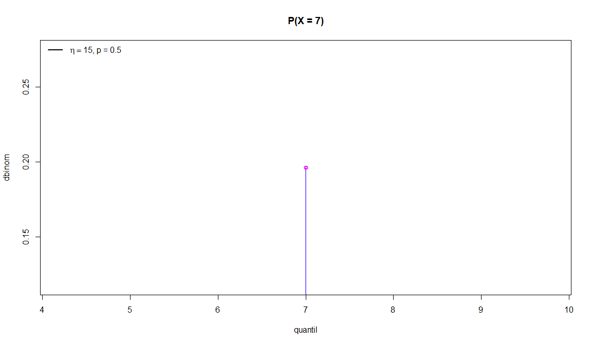
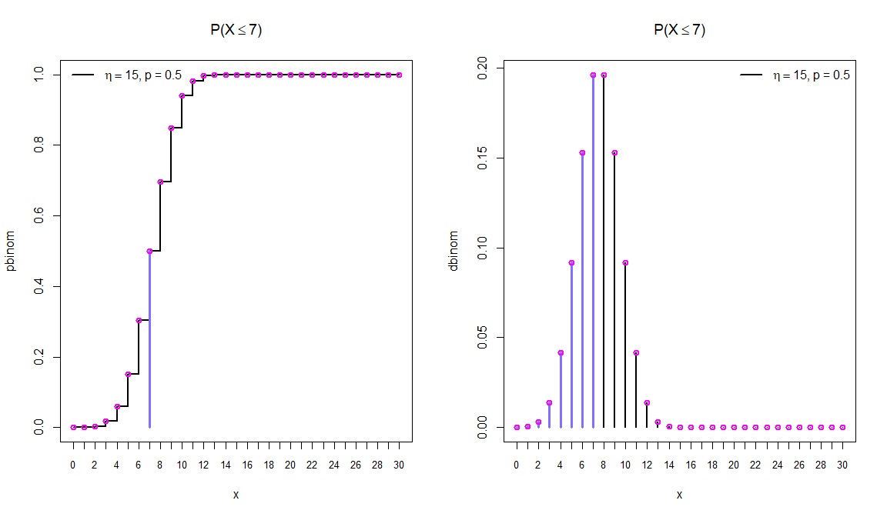
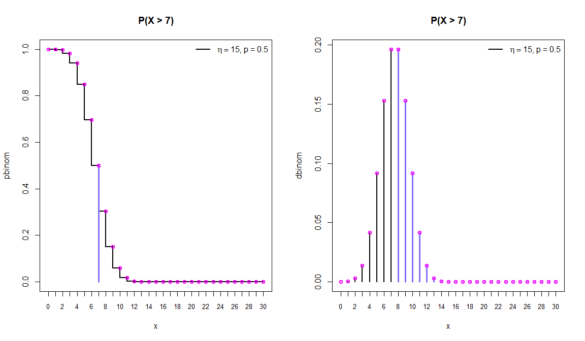
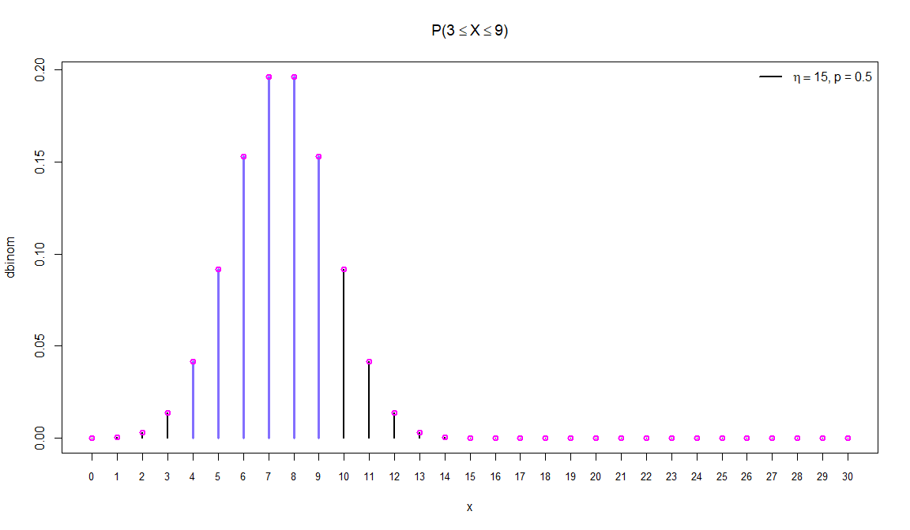

Distribuição Binomial B\[\(\eta\), p\]
================

### Seja X uma variável aleatória discreta, X tem uma distribuição binomial de **sucessos** em um dado número de experimentos (\(\eta\)) com probabilidade **p** de sucesso em cada experimento se sua função de probabilidade (f.p) for definida como:

\[P(X = x) = \frac{\eta!}{x!(\eta - x)!} p^xq^{(\eta - x)}, q = 1 - p\]

## Exemplos com X \~ B \[15, 0.5\] \(\eta = 15\), p = 0.5

### Cálculo da função de probabilidade (f.p) no quantil x = 7

``` r
quantil = 7
x = seq(0, 30)
```

``` r
plot(quantil, dbinom(quantil, 15, 0.5), type = 'h', main = 'P(X = 7)', lwd = 2.5, ylab = 'dbinom', cex = 1.5, col = 'SlateBlue1')
points(quantil, dbinom(quantil, 15, 0.5), col = 'magenta', lwd = 2)
legend("topleft", legend = expression(paste(eta == 15, ', p = 0.5')),
      lty=1, col=c('black'), lwd=2, bty="n")
```

<!-- -->

\(P(X = 7) =\)

``` r
dbinom(quantil, 15, 0.5)
```

    ## [1] 0.1963806

### Cálculo da probabilidade (f.d.a) até o quantil x = 7

``` r
par(mfrow = c(1, 2))

plot(x, pbinom(x, 15, 0.5), type = 's', main = expression(paste('P(X', phantom()<= 7, ')')), lwd = 2.5, ylab = 'pbinom', cex = 1.5, xaxt = 'n')
points(quantil, pbinom(quantil, 15, 0.5), type = 'h', col = 'SlateBlue1', lwd = 3)
axis(1, at = x, labels = x, cex.axis = 0.8)
points(x, pbinom(x, 15, 0.5), col = 'magenta', lwd = 2)
legend("topleft", legend = expression(paste(eta == 15, ', p = 0.5')),
      lty=1, col=c('black'), lwd=2, bty="n")

plot(x, dbinom(x, 15, 0.5), type = 'h', main = expression(paste('P(X', phantom()<= 7, ')')), lwd = 2.5, ylab = 'dbinom', cex = 1.5, xaxt = 'n')
points(x[x <= quantil], dbinom(x[x <= quantil], 15, 0.5), type = 'h', col = 'SlateBlue1', lwd = 3)
axis(1, at = x, labels = x, cex.axis = 0.8)
points(x, dbinom(x, 15, 0.5), col = 'magenta', lwd = 2)
legend("topright", legend = expression(paste(eta == 15, ', p = 0.5')),
      lty=1, col=c('black'), lwd=2, bty="n")
```

<!-- -->

\(P(X \leq 7) =\)

``` r
pbinom(quantil, 15, 0.5)
```

    ## [1] 0.5

ou utilizando a função **dbinom**

``` r
cat('P(X <= 7) = P(X = 0) + P(X = 1) + ... + P(X = 6) + P(X = 7) =', sum(dbinom(x[x <= quantil], 15, 0.5)))
```

    ## P(X <= 7) = P(X = 0) + P(X = 1) + ... + P(X = 6) + P(X = 7) = 0.5

``` r
par(mfrow = c(1, 2))

plot(x, pbinom(x, 15, 0.5, lower.tail = FALSE), type = 'S', main = 'P(X > 7)', lwd = 2.5, ylab = 'pbinom', cex = 1.5, xaxt = 'n')
points(quantil, pbinom(quantil, 15, 0.5, lower.tail = FALSE), type = 'h', col = 'SlateBlue1', lwd = 3)
axis(1, at = x, labels = x, cex.axis = 0.8)
points(x, pbinom(x, 15, 0.5, lower.tail = FALSE), col = 'magenta', lwd = 2)
legend("topright", legend = expression(paste(eta == 15, ', p = 0.5')),
      lty=1, col=c('black'), lwd=2, bty="n")

plot(x, dbinom(x, 15, 0.5), type = 'h', main = 'P(X > 7)', lwd = 2.5, ylab = 'dbinom', cex = 1.5, xaxt = 'n')
points(x[x > quantil], dbinom(x[x > quantil], 15, 0.5), type = 'h', col = 'SlateBlue1', lwd = 3)
axis(1, at = x, labels = x, cex.axis = 0.8)
points(x, dbinom(x, 15, 0.5), col = 'magenta', lwd = 2)
legend("topright", legend = expression(paste(eta == 15, ', p = 0.5')),
      lty=1, col=c('black'), lwd=2, bty="n")
```

<!-- -->

\(P(X > 7) =\)

``` r
pbinom(quantil, 15, 0.5, lower.tail = FALSE)
```

    ## [1] 0.5

ou utilizando a função **dbinom**

``` r
cat('P(X > 7) = P(X = 8) + P(X = 9) + ... + P(X = 29) + P(X = 30) =', sum(dbinom(x[x > quantil], 15, 0.5)))
```

    ## P(X > 7) = P(X = 8) + P(X = 9) + ... + P(X = 29) + P(X = 30) = 0.5

<!-- -->

\(P(3 \leq X \leq 9) =\)

``` r
pbinom(9, 15, 0.5) - pbinom(3, 15, 0.5)
```

    ## [1] 0.831543

ou utilizando a função **dbinom**

``` r
sum(dbinom(x[x <= 9], 15, 0.5)) - sum(dbinom(x[x <= 3], 15, 0.5))
```

    ## [1] 0.831543

ou

``` r
sum(dbinom(x[x <= 9 & x > 3], 15, 0.5))
```

    ## [1] 0.831543
