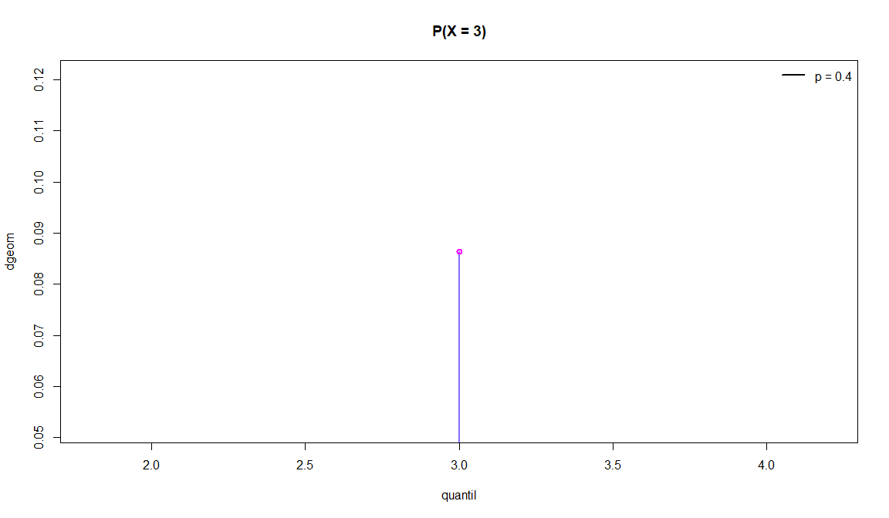
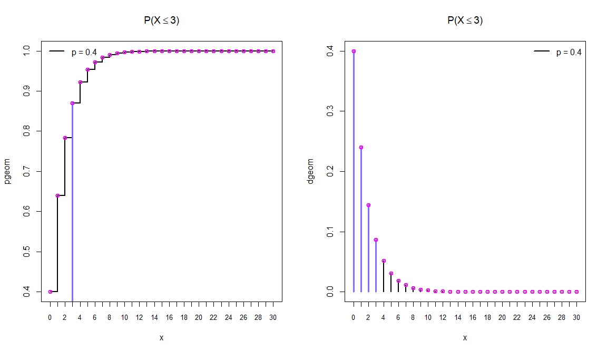
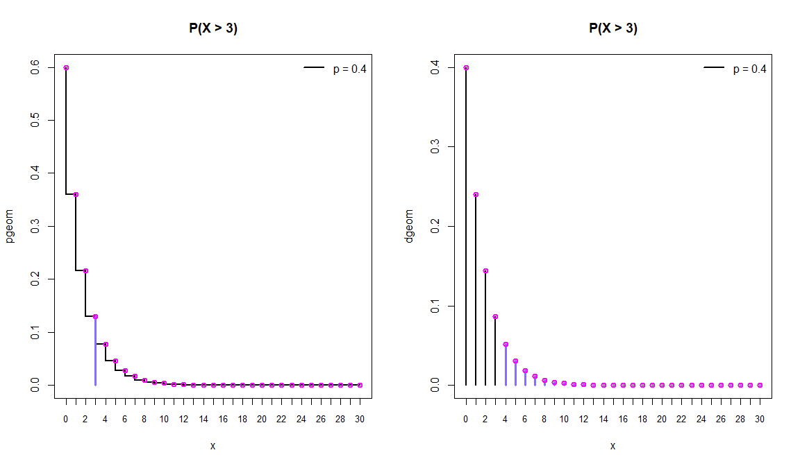
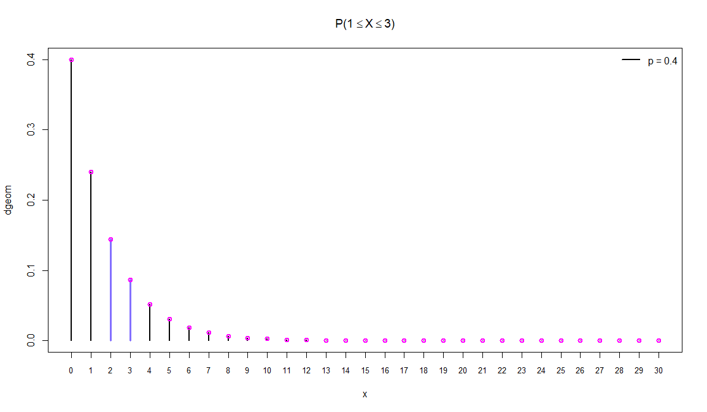

Distribuição Geométrica Geo\[p\]
================

### Seja X uma variável aleatória discreta, X tem uma distribuição geométrica, com probabilidade de **sucesso** **p** em cada experimento, se sua função de probabilidade (f.p) for definida como:

\[P(X = x) = (1 - p)^{x - 1}p\]

## Exemplos com X \~ Geo \[0.4\] p = 0.4

### Cálculo da função de probabilidade (f.p) no quantil x = 3

``` r
quantil = 3
x = seq(0, 30)
```

``` r
plot(quantil, dgeom(quantil, 0.4), type = 'h', main = 'P(X = 3)', lwd = 2.5, ylab = 'dgeom', cex = 1.5, col = 'SlateBlue1')
points(quantil, dgeom(quantil, 0.4), col = 'magenta', lwd = 2)
legend("topright", legend = c('p = 0.4'),
      lty=1, col=c('black'), lwd=2, bty="n")
```

<!-- -->

\(P(X = 3) =\)

``` r
dgeom(quantil, 0.4)
```

    ## [1] 0.0864

### Cálculo da probabilidade (f.d.a) até o quantil x = 3

``` r
par(mfrow = c(1, 2))

plot(x, pgeom(x, 0.4), type = 's', main = expression(paste('P(X', phantom()<= 3, ')')), lwd = 2.5, ylab = 'pgeom', cex = 1.5, xaxt = 'n')
points(quantil, pgeom(quantil, 0.4), type = 'h', col = 'SlateBlue1', lwd = 3)
axis(1, at = x, labels = x, cex.axis = 0.8)
points(x, pgeom(x, 0.4), col = 'magenta', lwd = 2)
legend("topleft", legend = c('p = 0.4'),
      lty=1, col=c('black'), lwd=2, bty="n")

plot(x, dgeom(x, 0.4), type = 'h', main = expression(paste('P(X', phantom()<= 3, ')')), lwd = 2.5, ylab = 'dgeom', cex = 1.5, xaxt = 'n')
points(x[x <= quantil], dgeom(x[x <= quantil], 0.4), type = 'h', col = 'SlateBlue1', lwd = 3)
axis(1, at = x, labels = x, cex.axis = 0.8)
points(x, dgeom(x, 0.4), col = 'magenta', lwd = 2)
legend("topright", legend = c('p = 0.4'),
      lty=1, col=c('black'), lwd=2, bty="n")
```

<!-- -->

\(P(X \leq 3) =\)

``` r
pgeom(quantil, 0.4)
```

    ## [1] 0.8704

ou utilizando a função **dgeom**

``` r
cat('P(X <= 3) = P(X = 0) + P(X = 1) + P(X = 3) =', sum(dgeom(x[x <= quantil], 0.4)))
```

    ## P(X <= 3) = P(X = 0) + P(X = 1) + P(X = 3) = 0.8704

``` r
par(mfrow = c(1, 2))

plot(x, pgeom(x, 0.4, lower.tail = FALSE), type = 'S', main = 'P(X > 3)', lwd = 2.5, ylab = 'pgeom', cex = 1.5, xaxt = 'n')
points(quantil, pgeom(quantil, 0.4, lower.tail = FALSE), type = 'h', col = 'SlateBlue1', lwd = 3)
axis(1, at = x, labels = x, cex.axis = 0.8)
points(x, pgeom(x, 0.4, lower.tail = FALSE), col = 'magenta', lwd = 2)
legend("topright", legend = c('p = 0.4'),
      lty=1, col=c('black'), lwd=2, bty="n")

plot(x, dgeom(x, 0.4), type = 'h', main = 'P(X > 3)', lwd = 2.5, ylab = 'dgeom', cex = 1.5, xaxt = 'n')
points(x[x > quantil], dgeom(x[x > quantil], 0.4), type = 'h', col = 'SlateBlue1', lwd = 3)
axis(1, at = x, labels = x, cex.axis = 0.8)
points(x, dgeom(x, 0.4), col = 'magenta', lwd = 2)
legend("topright", legend = c('p = 0.4'),
      lty=1, col=c('black'), lwd=2, bty="n")
```

<!-- -->

\(P(X > 3) =\)

``` r
pgeom(quantil, 0.4, lower.tail = FALSE)
```

    ## [1] 0.1296

ou utilizando a função **dgeom**

``` r
cat('P(X > 3) = P(X = 4) + P(X = 5) + ... + P(X = 30) =', sum(dgeom(x[x > quantil], 0.4)))
```

    ## P(X > 3) = P(X = 4) + P(X = 5) + ... + P(X = 30) = 0.1295999

<!-- -->

\(P(1 \leq X \leq 3) =\)

``` r
pgeom(3, 0.4) - pgeom(1, 0.4)
```

    ## [1] 0.2304

ou utilizando a função **dgeom**

``` r
sum(dgeom(x[x <= 3], 0.4)) - sum(dgeom(x[x <= 1], 0.4))
```

    ## [1] 0.2304

ou

``` r
sum(dgeom(x[x <= 3 & x > 1], 0.4))
```

    ## [1] 0.2304
