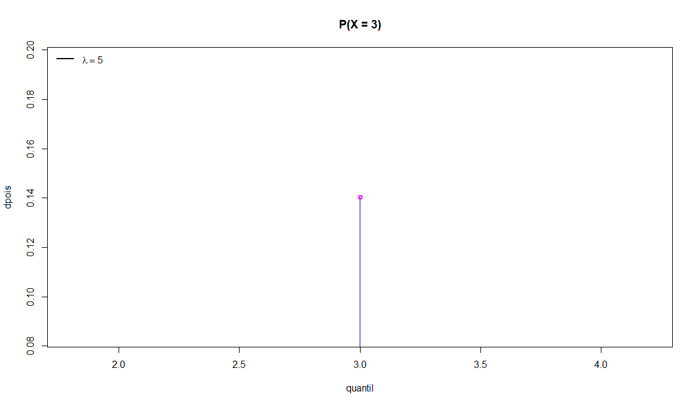
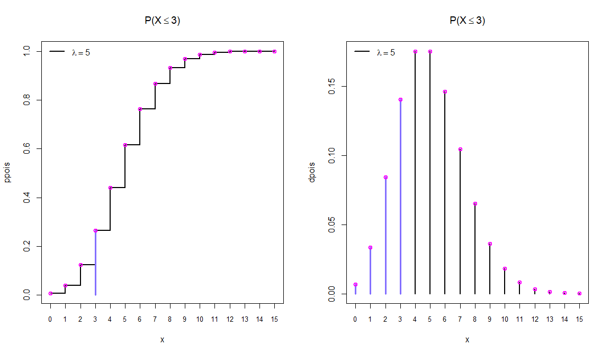
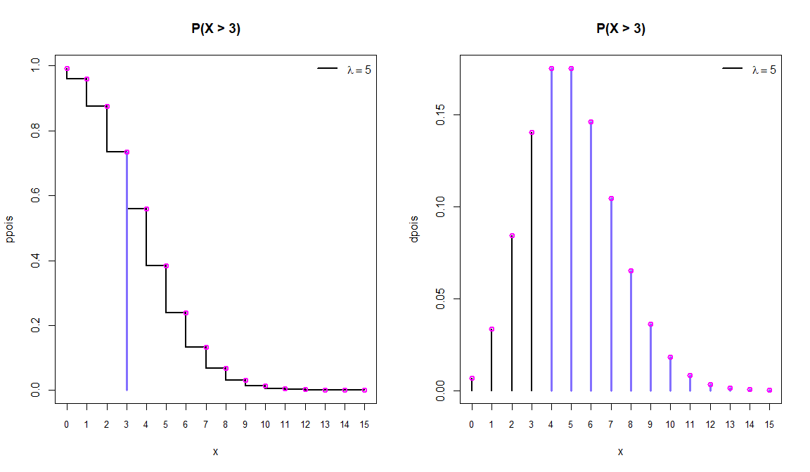
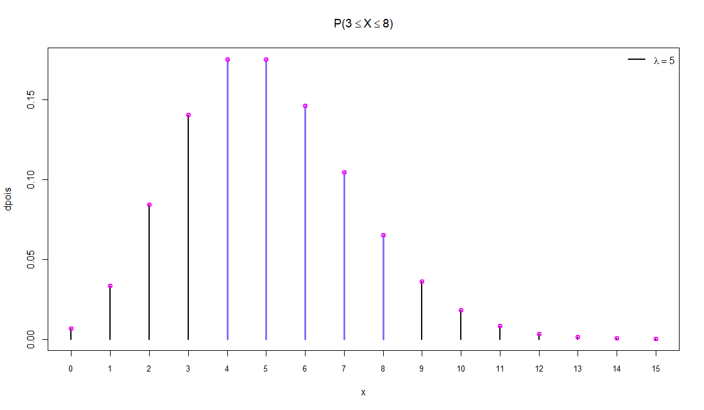

Distribuição de Poisson Pois\[\(\lambda\)\]
================

### Seja X uma variável aleatória discreta, X tem uma distribuição de Poisson com parâmetro \(\lambda > 0\) (\(\lambda\) = média de eventos em um intervalo de tempo) se sua função de probabilidade (f.p) for definida como:

\[P(X = x) = \frac{\exp[-\lambda]\lambda^x}{x!}\]

## Exemplos com X \~ Pois \[5\] \(\lambda = 5\)

### Cálculo da função de probabilidade no quantil x = 3 (f.p)

``` r
quantil = 3
x = seq(0, 15)
```

``` r
plot(quantil, dpois(quantil, 5), type = 'h', main = 'P(X = 3)', 
     lwd = 2.5, ylab = 'dpois', cex = 1.5, col = 'SlateBlue1')
points(quantil, dpois(quantil, 5), col = 'magenta', lwd = 2)
legend("topleft", legend = expression(paste(lambda == 5)),
      lty=1, col=c('black'), lwd=2, bty="n")
```

<!-- -->

\(P(X = 3) =\)

``` r
dpois(quantil, 5)
```

    ## [1] 0.1403739

### Cálculo da probabilidade (f.d.a) até o quantil x = 3

``` r
par(mfrow = c(1, 2))

plot(x, ppois(x, 5), type = 's', main = expression(paste('P(X', phantom()<= 3, ')')), lwd = 2.5, ylab = 'ppois', cex = 1.5, xaxt = 'n')
points(quantil, ppois(quantil, 5), type = 'h', col = 'SlateBlue1', lwd = 3)
axis(1, at = x, labels = x, cex.axis = 0.8)
points(x, ppois(x, 5), col = 'magenta', lwd = 2)
legend("topleft", legend = expression(paste(lambda == 5)),
      lty=1, col=c('black'), lwd=2, bty="n")

plot(x, dpois(x, 5), type = 'h', main = expression(paste('P(X', phantom()<= 3, ')')), lwd = 2.5, ylab = 'dpois', cex = 1.5, xaxt = 'n')
points(x[x <= quantil], dpois(x[x <= quantil], 5), type = 'h', col = 'SlateBlue1', lwd = 3)
axis(1, at = x, labels = x, cex.axis = 0.8)
points(x, dpois(x, 5), col = 'magenta', lwd = 2)
legend("topleft", legend = expression(paste(lambda == 5)),
      lty=1, col=c('black'), lwd=2, bty="n")
```

<!-- -->

\(P(X \leq 3) =\)

``` r
ppois(quantil, 5)
```

    ## [1] 0.2650259

ou utilizando a função **dpois**

``` r
cat('P(X <= 3) = P(X = 0) + P(X = 1) + P(X = 2) + P(X = 3) =', sum(dpois(x[x <= quantil], 5)))
```

    ## P(X <= 3) = P(X = 0) + P(X = 1) + P(X = 2) + P(X = 3) = 0.2650259

``` r
par(mfrow = c(1, 2))

plot(x, ppois(x, 5, lower.tail = FALSE), type = 'S', main = 'P(X > 3)', lwd = 2.5, ylab = 'ppois', cex = 1.5, xaxt = 'n')
points(quantil, ppois(quantil, 5, lower.tail = FALSE), type = 'h', col = 'SlateBlue1', lwd = 3)
axis(1, at = x, labels = x, cex.axis = 0.8)
points(x, ppois(x, 5, lower.tail = FALSE), col = 'magenta', lwd = 2)
legend("topright", legend = expression(paste(lambda == 5)),
      lty=1, col=c('black'), lwd=2, bty="n")

plot(x, dpois(x, 5), type = 'h', main = 'P(X > 3)', lwd = 2.5, ylab = 'dpois', cex = 1.5, xaxt = 'n')
points(x[x > quantil], dpois(x[x > quantil], 5), type = 'h', col = 'SlateBlue1', lwd = 3)
axis(1, at = x, labels = x, cex.axis = 0.8)
points(x, dpois(x, 5), col = 'magenta', lwd = 2)
legend("topright", legend = expression(paste(lambda == 5)),
      lty=1, col=c('black'), lwd=2, bty="n")
```

<!-- -->

\(P(X > 3) =\)

``` r
ppois(quantil, 5, lower.tail = FALSE)
```

    ## [1] 0.7349741

ou utilizando a função **dpois**

``` r
cat('P(X > 3) = P(X = 4) + P(X = 5) + ... + P(X = 14) + P(X = 15) =', sum(dpois(x[x > quantil], 5)))
```

    ## P(X > 3) = P(X = 4) + P(X = 5) + ... + P(X = 14) + P(X = 15) = 0.7349051

<!-- -->

\(P(3 \leq X \leq 8) =\)

``` r
ppois(8, 5) - ppois(quantil, 5)
```

    ## [1] 0.6668804

ou utilizando a função de probabilidade **dpois**

``` r
sum(dpois(x[x <= 8], 5)) - sum(dpois(x[x <= quantil], 5))
```

    ## [1] 0.6668804

ou

``` r
sum(dpois(x[x <= 8 & x > quantil], 5))
```

    ## [1] 0.6668804
