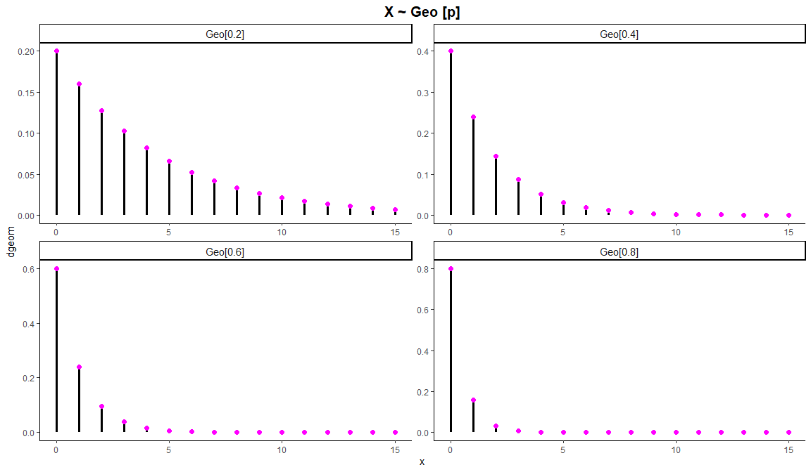

Modelos Probabilísticos Discretos
================


| Distribuicao | Parametros |  f.p   | f.d.a  | Quantil | Amostra |
| :----------: | :--------: | :----: | :----: | :-----: | :-----: |
|   Poisson    |   lambda   | dpois  | ppois  |  qpois  |  rpois  |
|   Binomial   | size, prob | dbinom | pbinom | qbinom  | rbinom  |
|  Geométrica  |    prob    | dgeom  | pgeom  |  qgeom  |  rgeom  |

# Distribuição Poisson Pois\[\(\lambda\)\]

``` r
par(mfrow = c(2, 2))

x = seq(0, 30)
plot(x, dpois(x, 1), type = 'h', main = expression(paste('Poisson Pois [', lambda = 1, ']')), lwd = 2.5, ylab = 'dpois', cex = 1.5)
points(x, dpois(x, 1), col = 'magenta', lwd = 2)

plot(x, dpois(x, 5), type = 'h', main = expression(paste('Poisson Pois [', lambda = 5, ']')), lwd = 2.5, ylab = 'dpois', col = 'blue', cex = 1.5)
points(x, dpois(x, 5), col = 'magenta', lwd = 2)

plot(x, dpois(x, 10), type = 'h', main = expression(paste('Poisson Pois [', lambda = 10, ']')), lwd = 2.5, ylab = 'dpois', col = 'green', cex = 1.5)
points(x, dpois(x, 10), col = 'magenta', lwd = 2)

plot(x, dpois(x, 15), type = 'h', main = expression(paste('Poisson Pois [', lambda = 15, ']')), lwd = 2.5, ylab = 'dpois', col = 'brown', cex = 1.5)
points(x, dpois(x, 15), col = 'magenta', lwd = 2)
```

<!-- -->

# \[ggplot\] - Distribuição Poisson Pois\[\(\lambda\)\]

``` r
eixox = seq(0, 30)
data.pois = data.frame(x = eixox, y1 = dpois(eixox, 1), y2 = dpois(eixox, 5),
                          y3 = dpois(eixox, 10), y4 = dpois(eixox, 15))

data.pois.long = tidyr::gather(data.pois, key = 'variavel', value = 'metrica', names(data.pois)[-1])

nomes = c('Pois[1]', 'Pois[5]', 'Pois[10]', 'Pois[15]')
names(nomes) = names(data.pois)[-1]
```

## ggplot com **geom\_segment + geom\_point**

``` r
ggplot(data.pois.long, aes(x = x, y = metrica)) + 
  geom_segment(aes(xend = x, y = 0, yend = metrica), size = 1.15) + 
  geom_point(color = 'magenta', size = 2) +
  facet_wrap(~variavel, labeller = labeller(variavel = nomes), scale = 'free') +
  labs(title = expression(paste('X ~ Pois[', lambda, ']')), y = 'dpois') +
  theme_classic() +
  theme(plot.title = element_text(hjust = 0.5, size = 15, face = 'bold'), 
        strip.text.x = element_text(size = 11))
```

<!-- -->

## ggplot com **geom\_col**

``` r
ggplot(data.pois.long, aes(x = x, y = metrica)) + 
  geom_col(width = 0.25) +
  facet_wrap(~variavel, labeller = labeller(variavel = nomes), scale = 'free') +
  labs(title = expression(paste('X ~ Pois[', lambda, ']')), y = 'dpois') +
  theme_classic() +
  theme(plot.title = element_text(hjust = 0.5, size = 15, face = 'bold'), 
        strip.text.x = element_text(size = 11))
```

<!-- -->

# Distribuição Binomial B\[\(\eta\), p\]

``` r
par(mfrow = c(2, 2))

x = seq(0, 30)
plot(x, dbinom(x, 1, 0.2), type = 'h', main = expression(paste('Binomial B [', eta = 1, ', 0.2]')), lwd = 2.5, ylab = 'dbinom', cex = 1.5)
points(x, dbinom(x, 1, 0.2), col = 'magenta', lwd = 2)

plot(x, dbinom(x, 5, 0.2), type = 'h', main = expression(paste('Binomial B [', eta = 5, ', 0.2]')), lwd = 2.5, ylab = 'dbinom', col = 'blue', cex = 1.5)
points(x, dbinom(x, 5, 0.2), col = 'magenta', lwd = 2)

plot(x, dbinom(x, 15, 0.5), type = 'h', main = expression(paste('Binomial B [', eta = 15, ', 0.5]')), lwd = 2.5, ylab = 'dbinom', col = 'green', cex = 1.5)
points(x, dbinom(x, 15, 0.5), col = 'magenta', lwd = 2)

plot(x, dbinom(x, 30, 0.5), type = 'h', main = expression(paste('Binomial B [', eta = 30, ', 0.5]')), lwd = 2.5, ylab = 'dbinom', col = 'brown', cex = 1.5)
points(x, dbinom(x, 30, 0.5), col = 'magenta', lwd = 2)
```

<!-- -->

# \[ggplot\] - Distribuição Binomial B\[\(\eta\), p\]

``` r
eixox = seq(0, 30)
data.binomial = data.frame(x = eixox, y1 = dbinom(eixox, 1, 0.2), y2 = dbinom(eixox, 5, 0.2),
                          y3 = dbinom(eixox, 15, 0.5), y4 = dbinom(eixox, 30, 0.5))

data.binomial.long = tidyr::gather(data.binomial, key = 'variavel', value = 'metrica', names(data.binomial)[-1])

nomes = c('B[1, 0.2]', 'B[5, 0.2]', 'B[15, 0.5]', 'B[30, 0.5]')
names(nomes) = names(data.binomial)[-1]
```

## ggplot com **geom\_segment + geom\_point**

``` r
ggplot(data.binomial.long, aes(x = x, y = metrica)) + 
  geom_segment(aes(xend = x, y = 0, yend = metrica), size = 1.15) + 
  geom_point(color = 'magenta', size = 2) +
  facet_wrap(~variavel, labeller = labeller(variavel = nomes), scale = 'free') +
  labs(title = expression(paste('X ~ B [', eta, ', p]')), y = 'dbinom') +
  theme_classic() +
  theme(plot.title = element_text(hjust = 0.5, size = 15, face = 'bold'), 
        strip.text.x = element_text(size = 11))
```

<!-- -->

## ggplot com **geom\_col**

``` r
ggplot(data.binomial.long, aes(x = x, y = metrica)) + 
  geom_col(width = 0.25) +
  facet_wrap(~variavel, labeller = labeller(variavel = nomes), scale = 'free') +
  labs(title = expression(paste('X ~ B [', eta, ', p]')), y = 'dbinom') +
  theme_classic() +
  theme(plot.title = element_text(hjust = 0.5, size = 15, face = 'bold'), 
        strip.text.x = element_text(size = 11))
```

<!-- -->

# Distribuição Geométrica Geo\[p\]

``` r
par(mfrow = c(2, 2))

x = seq(0, 15)
plot(x, dgeom(x, 0.2), type = 'h', main = 'Geométrica Geo [0.2]', lwd = 2.5, ylab = 'dgeom', cex = 1.5)
points(x, dgeom(x, 0.2), col = 'magenta', lwd = 2)

plot(x, dgeom(x, 0.4), type = 'h', main = 'Geométrica Geo [0.4]', lwd = 2.5, ylab = 'dgeom', col = 'blue', cex = 1.5)
points(x, dgeom(x, 0.4), col = 'magenta', lwd = 2)

plot(x, dgeom(x, 0.6), type = 'h', main = 'Geométrica Geo [0.6]', lwd = 2.5, ylab = 'dgeom', col = 'green', cex = 1.5)
points(x, dgeom(x, 0.6), col = 'magenta', lwd = 2)

plot(x, dgeom(x, 0.8), type = 'h', main = 'Geométrica Geo [0.8]', lwd = 2.5, ylab = 'dgeom', col = 'brown', cex = 1.5)
points(x, dgeom(x, 0.8), col = 'magenta', lwd = 2)
```

<!-- -->

# \[ggplot\] - Distribuição Geométrica Geo\[p\]

``` r
eixox = seq(0, 15)
data.geometrica = data.frame(x = eixox, y1 = dgeom(eixox, 0.2), y2 = dgeom(eixox, 0.4),
                          y3 = dgeom(eixox, 0.6), y4 = dgeom(eixox, 0.8))

data.geometrica.long = tidyr::gather(data.geometrica, key = 'variavel', value = 'metrica', names(data.geometrica)[-1])

nomes = c('Geo[0.2]', 'Geo[0.4]', 'Geo[0.6]', 'Geo[0.8]')
names(nomes) = names(data.geometrica)[-1]
```

## ggplot com **geom\_segment + geom\_point**

``` r
ggplot(data.geometrica.long, aes(x = x, y = metrica)) + 
  geom_segment(aes(xend = x, y = 0, yend = metrica), size = 1.15) + 
  geom_point(color = 'magenta', size = 2) +
  facet_wrap(~variavel, labeller = labeller(variavel = nomes), scale = 'free') +
  labs(title = 'X ~ Geo [p]', y = 'dgeom') +
  theme_classic() +
  theme(plot.title = element_text(hjust = 0.5, size = 15, face = 'bold'), 
        strip.text.x = element_text(size = 11))
```

<!-- -->

## ggplot com **geom\_col**

``` r
ggplot(data.geometrica.long, aes(x = x, y = metrica)) + 
  geom_col(width = 0.25) +
  facet_wrap(~variavel, labeller = labeller(variavel = nomes), scale = 'free') +
  labs(title = 'X ~ Geo [p]', y = 'dgeom') +
  theme_classic() +
  theme(plot.title = element_text(hjust = 0.5, size = 15, face = 'bold'), 
        strip.text.x = element_text(size = 11))
```

<!-- -->
